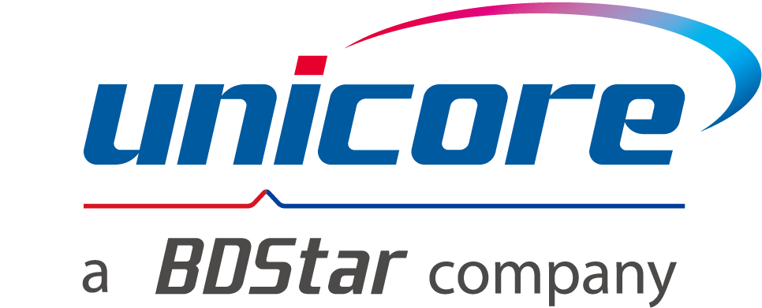
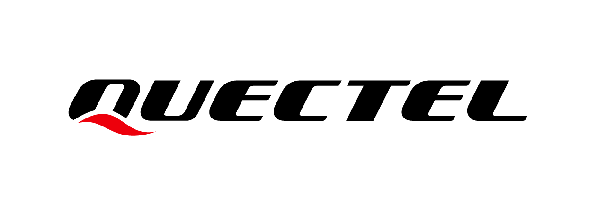
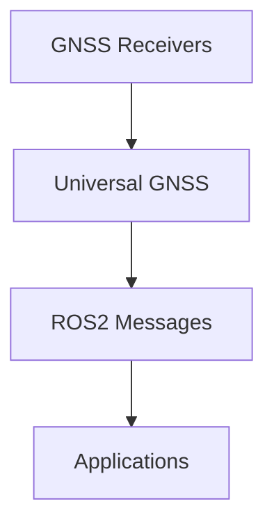

  
  
  
  
    

  
  
  
  
  
  
  
    

# Universal GNSS

Universal GNSS is a modular GNSS/RTK runtime stack designed for ROS 2, embedded systems, and RTK base stations.

The goal is to provide a vendor-agnostic GNSS layer capable of parsing, normalizing, configuring, and exposing GNSS data from multiple receiver families through a common runtime model.

## v0.6.0 Release Status

`v0.6.0` is the first release posture with:

- Auto Discovery v2
- Auto Configuration dry-run planning
- operator-driven runtime-only receiver apply for supported families

Current release guidance:

- live receiver writes do not occur unless `gnss_config_apply` is given
  explicit `--confirm` or `--yes`
- persistent apply is guarded and is not the default workflow
- stable `/dev/serial/by-id/*` paths are recommended over transient
  `/dev/ttyACM*` and `/dev/ttyUSB*` names whenever they exist
- UM982 runtime-only live apply should use an operator timeout around
  `--timeout-ms 5000`

## Goals

- Provide a portable GNSS core independent from ROS 2.
- Normalize GNSS runtime state across vendors.
- Support NMEA, RTCM3, u-blox UBX, Unicore, Quectel, and other protocols progressively.
- Expose consistent ROS 2 topics, services, and diagnostics.
- Support RTK rover and RTK base workflows.
- Keep parser, driver, transport, NTRIP, and ROS 2 layers separated.

## Non-goals

- Supporting every GNSS vendor message from day one.
- Replacing vendor tools for firmware updates.
- Mixing ROS 2 code into the portable parser core.

## Architecture

Current implemented layers:

- `gnss_core`
  - portable C++ runtime model
  - runtime aggregation of partial normalized updates
  - fix / RTK enums
  - capability and value flag system
  - no ROS 2 dependency
- `gnss_protocols`
  - portable framing and checksum helpers
  - NMEA semantic parsing: `GGA`, `RMC`, `GSA`, `GSV`
  - UBX semantic parsing: `NAV-STATUS`, `NAV-PVT`, `NAV-SAT`, `MON-RF`
  - Unicore ASCII semantic parsing: `PVTSLNA`, `BESTNAVA`, `RTKSTATUSA`, `RTCMSTATUSA`, `SATSINFOA`
  - RTCM3 framing, CRC24Q, and message-type extraction/classification
- `gnss_driver`
  - receiver profile declarations
  - protocol support and feature flags
  - lightweight stream-family detection
- `gnss_transport`
  - portable byte source / sink interfaces
  - memory-backed test / replay transport
  - Linux POSIX serial transport
  - transport metrics and buffer helpers
- `gnss_ntrip`
  - portable NTRIP config types
  - request and auth header generation
  - GGA injection policy types
  - connection metrics models
  - synchronous live client foundation and caster-monitor support
- `gnss_tools`
  - `rtcm_inspect` CLI for RTCM-only frame inspection
  - `gnss_inspect` CLI for structural mixed-stream frame inspection
  - `gnss_replay` CLI for semantic offline runtime replay
  - `gnss_profile_preview` CLI for offline receiver command/profile review
  - `gnss_config_plan` CLI for dry-run receiver config application planning
  - `gnss_config_apply` CLI for guarded operator-driven receiver config application
  - `gnss_serial_monitor` CLI for live Linux serial monitoring
  - `gnss_ntrip_monitor` CLI for live NTRIP caster testing
- `gnss_ros2`
  - ROS 2 package `universal_gnss_ros2`
  - `GnssStatus` message
  - `GnssRuntimeState -> GnssStatus` adapter
  - `GnssRuntimeState -> NavSatFix` adapter
  - `GnssHealthSummary -> DiagnosticArray` adapter
  - minimal `ReceiverNode` skeleton publishing `fix`, `status`, and `diagnostics`
  - serial receiver auto-discovery support for `ReceiverNode`
  - minimal `NtripNode` wrapper publishing `diagnostics` for ROS-side NTRIP state
  - minimal serial / TCP launch examples for `receiver_node`
  - minimal `ntrip.launch.py` example for the ROS2 NTRIP wrapper
  - minimal `receiver_and_ntrip.launch.py` combined bringup example

Planned layers:

- `gnss_protocols`
  - NMEA, RTCM3, UBX, Unicore, Quectel, and other protocol parsers
- `gnss_driver`
  - detection, configuration, and runtime-state mapping
- `gnss_transport`
  - serial, TCP / UDP, replay, and embedded byte-stream adapters
- `gnss_ntrip`
  - NTRIP client, RTCM relay, correction transport metrics
- `gnss_rtk_base`
  - survey-in, fixed-base workflows, RTCM routing
- `gnss_esp32`
  - lightweight embedded integration

The intended flow is:

See [docs/ros2.md](docs/ros2.md) for the ROS 2 adapter contracts, the
receiver/NTRIP node surfaces, and the current status / covariance policy.

See [docs/devcontainer.md](docs/devcontainer.md) for the reproducible ROS 2
devcontainer setup, Kilted build flow, future Lyrical switch path, and optional
serial hardware access examples.

See [docs/ros2_end_to_end_audit.md](docs/ros2_end_to_end_audit.md) for the
current receiver-to-ROS2-to-NTRIP audit status, combined launch coverage, and
the latest real receiver and real caster hardware smoke-test notes.

See [docs/robot_localization.md](docs/robot_localization.md) for the first
example of connecting Universal GNSS `fix` output to
`robot_localization/navsat_transform_node` and `ekf_node`.

See [docs/protocols.md](docs/protocols.md) for the current parser coverage,
runtime mapping coverage, and intentionally deferred protocol support.

See [docs/vendors/ublox/runtime_mapping.md](docs/vendors/ublox/runtime_mapping.md)
for the current u-blox-specific runtime mapping policy used by the UBX semantic
layer.

See [docs/vendors/unicore/runtime_mapping.md](docs/vendors/unicore/runtime_mapping.md)
for the current Unicore ASCII runtime mapping policy and extraction boundary
from earlier Mowgli-specific prototypes.

See [docs/driver.md](docs/driver.md) for the current driver-layer boundary,
receiver profiles, and stream-detection foundation.

See [docs/runtime_aggregation.md](docs/runtime_aggregation.md) for the generic
merge rules that combine partial protocol/runtime updates into one coherent
`GnssRuntimeState`.

See [docs/tools.md](docs/tools.md) for the current offline inspection CLIs,
profile preview, config-plan, guarded config-apply usage examples, runtime
replay usage examples, and the live serial / NTRIP monitors.

See [docs/transport.md](docs/transport.md) for the current portable byte-stream
abstraction layer and memory transport behavior.

See [docs/ntrip.md](docs/ntrip.md) for the current NTRIP layer scope,
request-format policy, and deferred networking work.

## License

This project is licensed under LGPLv3.

## Support the project

If Universal GNSS helps your projects and you would like to support development:

☕ Buy me a coffee:
https://buymeacoffee.com/x8ndjtgsrwg

Your support helps fund:
- GNSS hardware (u-blox, Unicore, Quectel, etc.)
- RTK testing
- CI infrastructure
- Documentation and tooling

## Trademarks

u-blox®, Unicore®, Quectel®, and Septentrio® are trademarks of their respective owners.

Universal GNSS is an independent open-source project and is not affiliated with, endorsed by, or sponsored by any of these companies.
