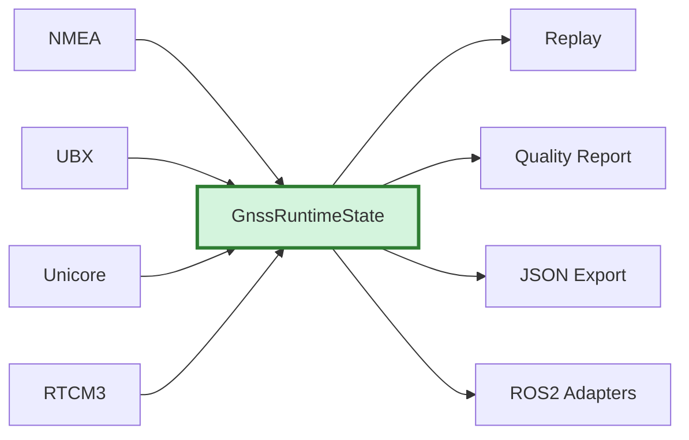

# Low-Level Readiness Audit

This document records the final low-level stabilization audit from the period
before ROS2 integration began.

It answers one question:

At the time, the question was whether the portable non-ROS2 stack was ready to
stop adding foundational protocol and transport work, tag `v0.4`, and begin
ROS2 receiver-node integration.

## Verdict

Historical verdict: ready for the ROS2 phase.

The current low-level stack is coherent across:

- protocol framing and semantic parsing
- normalized runtime mapping
- runtime aggregation
- receiver sessions and drivers
- transport adapters
- NTRIP client foundations
- offline and live low-level tools
- portable diagnostics and health summaries

No new low-level blocker was found in this audit.

Known gaps remain, but they are intentionally deferred and do not block the
start of ROS2 integration.

Validation baseline for this audit:

- date: `2026-06-01`
- local validation commands:
  - `cmake -S . -B build`
  - `cmake --build build`
  - `ctest --test-dir build --output-on-failure`
- current result: `58/58` tests passed

For the detailed per-message routing matrix, see
[docs/runtime_audit.md](runtime_audit.md).

## A. Protocol Readiness

| Area | Status | Notes |
| --- | --- | --- |
| NMEA | ready | `GGA`, `RMC`, `GSA`, `GSV`, `GST`, `VTG`, `ZDA` implemented; `VTG` maps portable speed/course and `ZDA` maps receiver-observed UTC date/time |
| UBX / u-blox | ready | `NAV-PVT`, `NAV-DOP`, `NAV-SAT`, `NAV-STATUS`, `MON-HW`, `MON-HW2`, `MON-RF`, `RXM-RTCM`, `ACK/NAK`, and `CFG` payload builders are in place; `MON-HW` classic payload is mapped conservatively, `MON-HW2` is parsed but remains semantic-only |
| Unicore ASCII | ready | runtime, correction-status, satellite, and RF / hardware coverage is present for the current planned low-level stack |
| Unicore binary `N4` | ready for current scope | framing exists, plus `BESTNAVB` and `PVTSLNB`; binary support is intentionally limited to the documented runtime-critical messages already implemented |
| RTCM3 | ready for current scope | framing, CRC24Q, message classification, correction monitor, and `1005/1006` base position decode are in place; full MSM semantic decode remains deferred |

Protocol-level conclusion:

- all currently supported families have a stable parser surface
- the runtime-relevant messages are mapped or intentionally documented as
  semantic-only
- no protocol family is blocked on transport or ROS2 code to be useful today

## B. Runtime Readiness

| Area | Status | Notes |
| --- | --- | --- |
| `GnssRuntimeState` | ready | current fields cover normalized fix, RTK, position, accuracy, DOP, satellites, CN0, correction age, heading, and generic RF booleans |
| capability / value flags | ready | current parsers use the capability/value model consistently for partial updates |
| `GnssRuntimeAggregator` | ready | partial updates merge field-by-field without erasing unrelated known state |
| diagnostics / health model | ready | portable diagnostic events and health summaries are already shared by RTCM, UBX, Unicore, and tooling |

Runtime-model conclusion:

- the portable core already supports the current cross-vendor low-level data we
  want to expose before ROS2
- semantic-only messages are explicitly deferred instead of leaking ad hoc
  fields into the runtime core

## C. Driver Readiness

| Area | Status | Notes |
| --- | --- | --- |
| `NmeaSession` / `NmeaDriver` | ready | generic NMEA-only runtime path exists; no configuration support by design |
| `UbloxSession` / `UbloxDriver` | ready | mixed `UBX` / `NMEA` / `RTCM3` routing works; runtime and correction metadata paths are present |
| `UnicoreSession` / `UnicoreDriver` | ready | ASCII and selected binary runtime paths work; text command/profile support exists |
| `ReceiverSession` | ready | explicit routing is solid; auto-detect stays intentionally conservative |
| `ReceiverSessionRunner` | ready | synchronous bridge from any `ByteSource` into the receiver-session stack is already present |

Driver-layer conclusion:

- there is enough vendor/session structure to build ROS2 nodes on top without
  inventing a new low-level architecture
- explicit driver selection is preferred for production-facing ROS2 work
- current auto-detect is adequate as a conservative helper, not a full hardware
  identification engine

## D. Transport Readiness

| Area | Status | Notes |
| --- | --- | --- |
| memory transport | ready | good for tests, replay, and deterministic integration cases |
| POSIX serial | ready for Linux-only scope | supports synchronous open/read/write/close and is already used by `gnss_serial_monitor` |
| TCP client | ready for synchronous client scope | used by the live NTRIP client foundation; no TLS or async ownership yet |

Transport conclusion:

- the project now has enough real transport coverage for live Linux testing
- the transport API remains small and reusable for ROS2 and later embedded
  adapters

## E. NTRIP Readiness

| Area | Status | Notes |
| --- | --- | --- |
| request / auth | ready | deterministic request builder and Basic Auth helper exist |
| TCP-backed live client | ready for current scope | synchronous `NtripClient` exists, with response handling and RTCM extraction |
| RTCM stream extraction | ready | incoming correction bytes are framed and fed into the RTCM correction monitor |
| GGA generation / injection | ready for explicit-call use | sentence builder, injector helper, and client integration exist |
| reconnect / backoff | ready for synchronous caller-driven use | policy and state model exist; caller still owns the outer loop |
| sourcetable parser | ready | typed sourcetable parsing and basic filtering helpers exist |

NTRIP conclusion:

- low-level caster connectivity and RTCM intake are ready for ROS2 integration
- deferred items such as TLS, periodic scheduling, and multi-caster ownership
  belong above this layer

## F. Tools Readiness

| Tool | Status | Notes |
| --- | --- | --- |
| `rtcm_inspect` | ready | RTCM-only framing / type / base-position inspection |
| `gnss_inspect` | ready | structural mixed-stream inspection across NMEA / UBX / Unicore / RTCM |
| `gnss_replay` | ready | offline normalized runtime reconstruction |
| `gnss_quality_report` | ready | offline quality summary with RTCM and receiver diagnostics |
| `gnss_export` | ready | stable JSONL runtime export |
| `gnss_serial_monitor` | ready for Linux manual testing | live serial runtime monitor on top of `ReceiverSessionRunner` |
| `gnss_ntrip_monitor` | ready for Linux manual testing | live caster / RTCM / reconnect diagnostics on top of `NtripClient` |
| `gnss_profile_preview` / `gnss_config_plan` / `gnss_config_apply` | ready for low-level config planning | command-generation and guarded apply plumbing exist without requiring ROS2 |

Tooling conclusion:

- the stack already has enough inspection, replay, export, config-preview, and
  live manual-monitoring support to unblock ROS2 development and later GUI work

## G. Test Readiness

Current test posture:

- CTest count: `58`
- current status: `58/58` passed
- protocol, driver, transport, NTRIP, and tool layers all participate in the
  suite
- the suite already covers both offline and live-foundation surfaces such as:
  - mixed replay and JSONL export
  - u-blox and Unicore runtime routing
  - RTCM correction monitor behavior
  - NTRIP client foundations
  - POSIX serial and TCP transports

Test conclusion:

- the project has crossed the threshold from parser demos to a stable,
  regression-tested low-level foundation
- more tests will still be needed during the ROS2 phase, but the low-level
  baseline is already strong enough to build on

## Known Deferred Areas

These remain intentionally deferred and do not block the ROS2 phase:

- ROS2 receiver node
- ROS2 NTRIP node
- ROS2 replay node
- GUI / dashboard work
- ESP32 integration
- LoRa / gateway policy
- RTK base gateway workflows
- future receiver vendors
- UBX `MON-SPAN`
- full RTCM MSM semantic decode
- Unicore raw observations
- TLS transport / NTRIP support
- UDP transport

## Historical Release Recommendation

This recommendation was accurate for the earlier low-level-only audit that
preceded ROS2 integration and Auto Configuration work. It is now superseded by
the release posture documented in [`ROADMAP.md`](../ROADMAP.md) and the
runtime-only operator workflow documented in
[`auto_configuration.md`](auto_configuration.md).

At the time of this audit, the recommended next step was:

- tag the current low-level stack as `v0.4`
- begin ROS2 receiver-node integration work
- avoid taking on broad new low-level vendor/protocol work until the first ROS2
  receiver-node path lands
