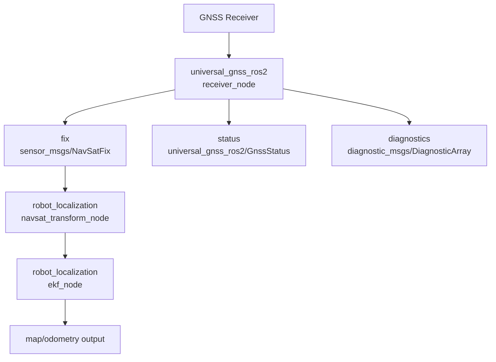
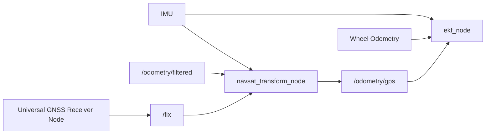

# robot_localization Integration

This document shows a minimal, conservative way to connect Universal GNSS to
`robot_localization` without pulling in Nav2 yet.

The intended data flow is:



## What Universal GNSS Provides

Today `receiver_node` publishes:

- `fix`: `sensor_msgs/msg/NavSatFix`
- `status`: `universal_gnss_ros2/msg/GnssStatus`
- `diagnostics`: `diagnostic_msgs/msg/DiagnosticArray`

For `robot_localization`, the critical topic is `fix`.

`status` and `diagnostics` remain useful alongside the EKF because they show:

- generic fix state
- RTK float / fixed state
- correction age
- satellite counts
- RF / jamming / interference state

## What robot_localization Still Needs

Universal GNSS does not replace the rest of the localization stack.

Typical responsibilities stay split like this:

- GNSS:
  - global latitude / longitude / altitude
  - GNSS-reported position quality
- IMU:
  - orientation or yaw source for `navsat_transform_node`
  - angular velocity and linear acceleration for the EKF
- wheel odometry or other local odometry:
  - short-term local motion continuity
  - smooth odom-frame motion between GNSS updates

GNSS alone is usually not enough for a stable mobile-robot localization stack.

## Frames

The examples use the common frame set:

- `map`
- `odom`
- `base_link`
- `gnss_link`

Assumptions:

- `gnss_link` is the antenna or receiver frame published by Universal GNSS
- `base_link` is the robot body frame used by the rest of the ROS stack
- static transforms between `base_link`, the IMU, and the GNSS antenna are
  provided elsewhere

## Example Files

The repository includes:

- [examples/robot_localization/ekf.yaml](/home/pepeuch/Documents/vscode/tondeuse/universal-gnss/examples/robot_localization/ekf.yaml)
- [examples/robot_localization/navsat_transform.yaml](/home/pepeuch/Documents/vscode/tondeuse/universal-gnss/examples/robot_localization/navsat_transform.yaml)
- [examples/robot_localization/robot_localization_example.launch.py](/home/pepeuch/Documents/vscode/tondeuse/universal-gnss/examples/robot_localization/robot_localization_example.launch.py)

These are examples, not production defaults.

They intentionally use:

- conservative EKF settings
- placeholder topic names for IMU and wheel odometry
- simple launch-time parameter forwarding

## navsat_transform_node Notes

`navsat_transform_node` needs three things:

- GNSS fix input
- IMU orientation or a trustworthy odometry yaw source
- the robot's current local odometry estimate

Key parameters to review in your system:

- `magnetic_declination_radians`
  - set this for your operating area if your IMU yaw is magnetic
- `yaw_offset`
  - use this only if your IMU or heading convention needs a fixed correction
- `use_odometry_yaw`
  - set `true` only when odometry yaw is already trustworthy
- `wait_for_datum`
  - set `true` if your workflow requires an explicit datum

The example keeps datum handling generic and leaves automatic datum behavior in
place.

## EKF Notes

The example EKF is intentionally modest:

- wheel odometry carries local velocity / pose continuity
- IMU carries orientation and inertial cues
- GPS-derived odometry from `navsat_transform_node` provides global position

That means:

- remove unused dimensions if you run a 2D robot
- adjust covariance and rejection thresholds to your platform
- do not blindly trust the example boolean config arrays

## Example Topology



## Example Usage

Build the ROS 2 package set, then launch the receiver node and
`robot_localization` example together:

```bash
ros2 launch /home/pepeuch/Documents/vscode/tondeuse/universal-gnss/examples/robot_localization/robot_localization_example.launch.py \
  serial_device:=/dev/ttyACM0 \
  serial_baud:=921600 \
  receiver_family:=unicore
```

For a u-blox receiver:

```bash
ros2 launch /home/pepeuch/Documents/vscode/tondeuse/universal-gnss/examples/robot_localization/robot_localization_example.launch.py \
  serial_device:=/dev/ttyUSB0 \
  serial_baud:=115200 \
  receiver_family:=ublox
```

If you prefer to launch the GNSS receiver separately, reuse the installed ROS 2
launch files:

```bash
ros2 launch universal_gnss_ros2 receiver_serial.launch.py \
  serial_device:=/dev/ttyACM0 \
  serial_baud:=921600 \
  receiver_family:=unicore
```

Then start your own `robot_localization` stack using the example YAMLs as a
starting point.

## Current Assumptions And Limits

- `NavSatFix` is the only GNSS topic used directly by `navsat_transform_node`
- `GnssStatus` is supplementary observability, not an EKF input
- no Universal GNSS ROS 2 NTRIP node exists yet
- no Nav2 integration is included yet
- no lifecycle / composition container examples are included yet
- Humble and Jazzy are still documentation-level targets, while Kilted is the
  locally validated ROS 2 environment
