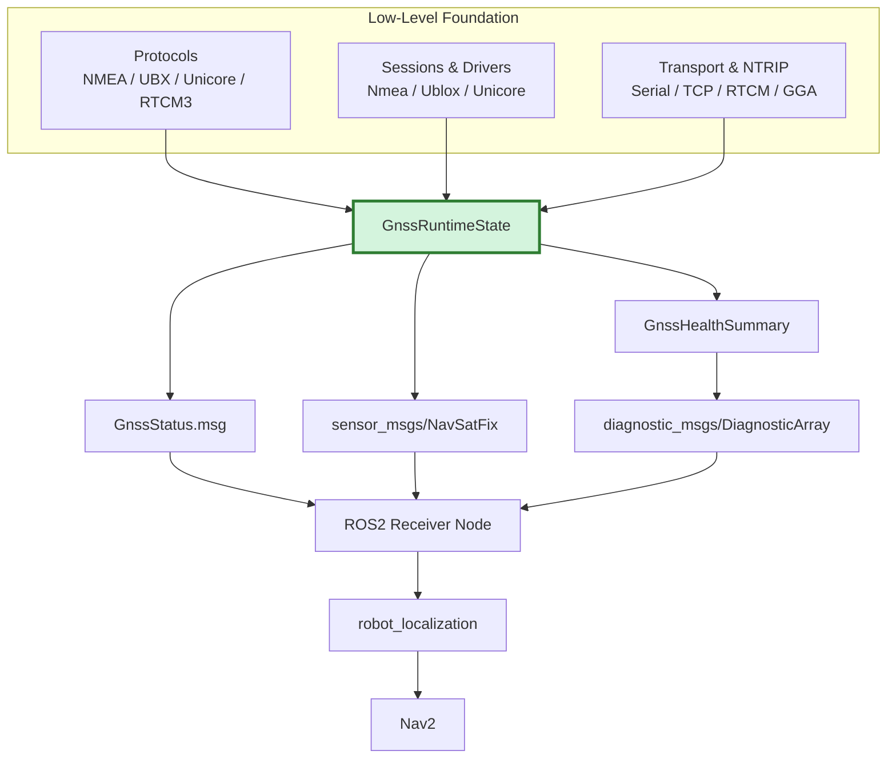

# ROS 2 Adapter Architecture

This document describes the current ROS 2 boundary for Universal GNSS.

Today the project contains two implemented layers:

- `gnss_core`: a portable, ROS-independent runtime model
- `gnss_ros2`: the ROS 2 package `universal_gnss_ros2`

The low-level stack is now implemented in sibling packages:

- `gnss_protocols`: NMEA, UBX/u-blox, Unicore, and RTCM parsing
- `gnss_driver`: receiver sessions, drivers, command/config plumbing
- `gnss_transport`: memory, POSIX serial, and TCP transport adapters
- `gnss_ntrip`: NTRIP request/auth/client foundations

Those layers are intentionally separate from `gnss_ros2`.

## Purpose

`universal_gnss_ros2` exists to project the portable `gnss_core` model into
standard ROS 2 types and messages without teaching the core about ROS.

Current responsibilities:

- expose a typed ROS 2 status message: `universal_gnss_ros2/msg/GnssStatus`
- convert `universal_gnss::GnssRuntimeState` to `GnssStatus`
- convert `universal_gnss::GnssRuntimeState` to `sensor_msgs/msg/NavSatFix`
- convert portable `GnssHealthSummary` / `GnssDiagnosticEvent` values into
  `diagnostic_msgs`
- provide a minimal `ReceiverNode` that composes the existing low-level
  sessions, transports, runner, and adapters into standard ROS 2 publishers
- provide a minimal `NtripNode` that wraps the existing low-level `NtripClient`
  in ROS 2 subscriptions, timers, and diagnostics

Current non-responsibilities:

- parsing NMEA, RTCM, UBX, Unicore, or any vendor protocol
- receiver-specific protocol logic
- receiver configuration ownership
- backend-specific fix inference
- low-level NTRIP protocol or reconnect implementation ownership
- downstream integration packages

That last point is starting to soften slightly: this repository now includes a
documented `robot_localization` example, but it is still an example layer, not a
fully owned integration package.

## Layer Split

The intended boundary is:



`gnss_core` is ROS-independent on purpose:

- it must stay portable to Linux and embedded targets such as ESP32
- it must not depend on ROS clocks, headers, or message packages
- it should remain reusable in non-ROS runtimes and test tools

`gnss_ros2` is where ROS-specific policies belong:

- message layout choices
- timestamp conversion to `builtin_interfaces/Time`
- `NavSatFix` status mapping
- covariance projection policy
- diagnostic-array projection policy
- ROS node-facing parameter and publisher policies

See [robot_localization.md](robot_localization.md)
for the first end-to-end example of how `receiver_node` feeds
`navsat_transform_node` and `ekf_node`.

## Typed Runtime State Philosophy

The core runtime state is the normalized contract between future parsers,
drivers, tools, and adapters.

Design goals:

- represent GNSS state with simple standard C++ types
- keep the model backend-agnostic
- distinguish "unsupported", "supported but currently unknown", and "known"
- avoid leaking vendor strings or receiver-specific hacks into public contracts

The runtime state is intentionally richer than `NavSatFix`. For example:

- RTK mode is explicit
- heading can exist independently of position quality
- canonical dual-antenna baseline geometry/status can exist independently of
  the legacy heading compatibility fields
- CN0, satellite counts, and correction age are first-class optional values

This lets future drivers normalize richer receiver telemetry before any ROS
projection happens.

## Capability And Value Flags

`GnssStatus` exists because `NavSatFix` cannot express enough normalized GNSS
runtime information by itself.

The contract uses two flag sets with the same bit assignments:

- `capability_flags`: which optional fields this runtime path can provide at all
- `value_flags`: which optional fields have a current value in this sample

This gives four useful states:

```text
capability=0, value=0 -> unsupported / unavailable on this path
capability=1, value=0 -> supported but no current value
capability=1, value=1 -> current value is present
```

For boolean fields this becomes:

```text
capability=1, value=1, field=false -> known false
capability=1, value=1, field=true  -> known true
```

## Invariant Rules

The core and ROS 2 adapter both rely on one strict invariant:

```text
value_flags must never contain a bit that is absent from capability_flags
```

Meaning:

- adapters must not claim a value for an unsupported field
- producers must not set a value flag unless the corresponding optional field is
  actually present
- consumers may safely interpret `capability=0` as "do not expect this field"

The ROS 2 status adapter preserves this invariant and asserts against invalid
core state in debug builds.

## GnssStatus Contract

`universal_gnss_ros2/msg/GnssStatus` is the ROS 2 projection of the normalized
runtime state.

Always-present fields:

- `stamp`
- `fix_valid`
- `fix_type`
- `rtk_mode`
- `capability_flags`
- `value_flags`

Coordinate fields:

- `latitude_deg`
- `longitude_deg`
- `altitude_m`

These are not capability-gated today. They are direct runtime values and use
`NaN` when unavailable.

Capability-gated optional fields:

- horizontal / vertical accuracy
- HDOP / VDOP
- satellites used / visible / tracked
- mean / max CN0
- correction age
- heading compatibility
- dual-antenna heading compatibility state
- dual-antenna baseline validity
- baseline azimuth / pitch / length
- baseline solution status
- interference state
- jamming state

Semantics:

- unsupported: capability bit is clear
- supported but unknown right now: capability bit set, value bit clear
- known value: capability bit set, value bit set

Unknown vs unsupported matters:

- `rtk_mode = UNKNOWN` with no capability bit means the path does not expose RTK mode
- `rtk_mode = UNKNOWN` with the capability bit set means RTK mode exists in the
  model but is not known for this sample
- generic NMEA `GGA` now sets a known `rtk_mode` from standard `fix_quality`
  values, so `/gps/status` can report `NONE`, `FLOAT`, or `FIXED` even without
  a vendor-specific backend

Timestamp semantics:

- the core stores an optional `timestamp_ns`
- the ROS 2 adapter converts it to `builtin_interfaces/Time`
- absent timestamps map to zero ROS time

Heading semantics:

- `heading_deg` is a normalized optional compatibility field
- it does not imply RTK-fixed position quality
- dual-antenna heading availability is tracked separately from numeric heading
- canonical dual-antenna baseline data uses:
  - `dual_antenna_baseline`
  - `baseline_azimuth_deg`
  - `baseline_pitch_deg`
  - `baseline_length_m`
  - `baseline_solution_status`
- during `v0.6.x`, solved baseline azimuth may also mirror into `heading_deg`
  for compatibility
- ROS2 consumers should prefer the canonical baseline fields over
  `heading_deg` / `dual_antenna_heading` when the source semantics are a
  dual-antenna baseline

Backend-agnostic guarantee:

- `GnssStatus` does not encode vendor names or backend aliases
- no field depends on a specific receiver family
- no parser-specific string parsing is required to consume the message

## Why Diagnostics Parsing Is Not In Adapters

Adapters are intentionally dumb projections from normalized runtime state into
ROS types.

Diagnostics parsing does not belong here because it would:

- couple ROS adapters to ad hoc text keys or vendor formats
- blur the line between normalization and transport
- make the ROS layer own backend-specific logic

That parsing/normalization logic belongs in the low-level stack:

- `gnss_protocols`: typed protocol parsing
- `gnss_driver`: receiver-family normalization and runtime mapping
- `gnss_ntrip`: correction transport and caster-facing behavior

## NavSatFix Adapter Policy

`sensor_msgs/msg/NavSatFix` remains useful for compatibility with the broader
ROS ecosystem, but it is a lossy projection of the typed runtime model.

### Status mapping

Current policy:

- missing coordinates, invalid fix, `UNKNOWN`, or `NO_FIX` -> `STATUS_NO_FIX`
- valid non-fixed solutions -> `STATUS_FIX`
- explicit RTK fixed only -> `STATUS_GBAS_FIX`
- generic NMEA reaches the same mapping when `GGA fix_quality = 4` provides an
  explicit normalized RTK-fixed state

This is intentionally conservative.

Why `STATUS_GBAS_FIX` is conservative:

- many real systems overload `NavSatStatus` in backend-specific ways
- Universal GNSS should not claim RTK-fixed certainty unless the normalized
  runtime state says so explicitly
- RTK float remains `STATUS_FIX`, not a stronger code

### Covariance policy

Covariance is optional.

Current rule:

- if both horizontal and vertical accuracy are present, publish a diagonal
  approximated covariance using `sigma^2`
- otherwise keep covariance type `UNKNOWN`

Why this is conservative:

- the core exposes scalar accuracy, not a full ellipsoid or full covariance matrix
- partial precision is not fabricated
- missing accuracy does not become fake "good enough" covariance

### frame_id policy

`frame_id` is intentionally left empty.

Reason:

- the portable core does not carry ROS frame semantics
- inventing a frame like `gps_link` in the adapter would be a policy decision
  that belongs in a higher ROS node if needed

### service bits policy

`NavSatStatus.service` is left at `0`.

Reason:

- the core currently does not model constellation/service provenance
- inferring service bits from thin runtime state would be guesswork

### RTK truth policy

RTK truth does not come from `NavSatFix` alone.

`NavSatFix` is treated as a compatibility output, not the authoritative runtime
model. The authoritative model is `GnssRuntimeState`, and the richer ROS view is
`GnssStatus`.

## Mapping Audit

The current field-by-field ROS projection contract lives in
[docs/ros2_mapping.md](ros2_mapping.md).

That document records:

- every `GnssRuntimeState` field and whether it reaches `GnssStatus`,
  `NavSatFix`, or ROS diagnostics helpers
- current intentional omissions such as semantic-only `VTG` / `ZDA`
- distro-compatibility assumptions for Humble, Jazzy, and Kilted

The same audit document also records the exact local Kilted build/test method
used for `universal_gnss_ros2` validation in the MowgliNext development image.

For the current runtime-node audit across `ReceiverNode`, `NtripNode`, launch
files, diagnostics behavior, and manual hardware-smoke procedure, see
[ros2_end_to_end_audit.md](ros2_end_to_end_audit.md).

## Receiver Node

`universal_gnss_ros2` now includes a first minimal receiver node skeleton:

- class: `universal_gnss_ros2::ReceiverNode`
- executable: `receiver_node`

The node is intentionally thin. It does not parse raw protocols itself. It
composes the existing low-level path:

```text
ByteSource -> ReceiverSessionRunner -> ReceiverSession -> GnssRuntimeState
           -> ROS adapters -> ROS 2 publishers
```

### Inputs

Supported transport parameters:

- `transport=serial`
- `transport=tcp`

Supported receiver families:

- `receiver_family=auto`
- `receiver_family=nmea`
- `receiver_family=ublox`
- `receiver_family=unicore`

Correction subscription:

- `rtcm`
  - type: `universal_gnss_ros2/msg/RtcmFrame`
  - used only when the active transport is writable

### Parameters

- `receiver_family`
- `transport`
- `serial_device`
- `serial_baud`
- `discovery_include_platform_uarts`
- `discovery_allow_generic_nmea`
- `discovery_timeout_ms`
- `discovery_max_probe_bytes`
- `auto_config_dry_run_enabled` (default `false`)
- `auto_config_profile` (default `rover_high_precision`)
- `tcp_host`
- `tcp_port`
- `publish_rate_hz`
- `frame_id`

Validation policy:

- invalid enum or range values fail node construction with a clear ROS error
- required transport-specific parameters must be present
- startup configuration errors do not silently fall back to another mode
- `serial_baud` accepts either an explicit integer baud or the string `auto`
- Auto Configuration is opt-in and dry-run only: setting
  `auto_config_dry_run_enabled=true` builds a driver-owned plan for
  `auto_config_profile`; no ROS2 parameter can select apply, persistence,
  reset, or vendor-specific override behavior.

Discovery policy:

- discovery is used only for `transport=serial`
- discovery runs only when `serial_device`, `serial_baud`, or `receiver_family`
  is set to `auto`
- if `serial_device` is explicit but `serial_baud` or `receiver_family` is
  `auto`, only that path is probed
- if `serial_device=auto`, the portable discovery layer enumerates candidate
  ports and selects the best acceptable result
- at least medium confidence is required
- generic `NMEA` auto-selection is accepted only when
  `discovery_allow_generic_nmea=true`
- onboard/platform UART scanning remains opt-in through
  `discovery_include_platform_uarts=true`
- discovery remains read-only and never reconfigures the receiver

Transport-open policy:

- configuration mistakes fail fast at startup
- runtime transport open/connect failures keep the node alive when possible and
  surface through `diagnostics`

### Outputs

Topics published by the skeleton node:

- `fix`
  - type: `sensor_msgs/msg/NavSatFix`
- `status`
  - type: `universal_gnss_ros2/msg/GnssStatus`
- `diagnostics`
  - type: `diagnostic_msgs/msg/DiagnosticArray`

The minimal launch examples now installed with the package are:

- `receiver_serial.launch.py`
- `receiver_tcp.launch.py`
- `receiver_and_ntrip.launch.py`

They are intentionally parameter-forwarding wrappers around `receiver_node`.

### Runtime behavior

The node now follows a conservative runtime policy:

- `status` and `diagnostics` are always publishable
- `fix` is only published when the runtime state has a fresh, finite latitude
  and longitude
- stale or disconnected runtime state suppresses `fix` publication instead of
  repeating old coordinates
- when the low-level runtime sample has no timestamp, the live node stamps
  outgoing `status`, `fix`, and `diagnostics` with the node clock instead of
  publishing zero ROS time

Diagnostic states surfaced by the node include:

- startup parameter validation failure
- receiver discovery attempted / succeeded / failed
- discovered path / baud / family / confidence, plus optional receiver identity,
  model, and firmware version when the read-only probe observed them
- auto-configuration dry-run planning under `universal_gnss/auto_config`, with
  explicit `not_requested`, `available`, `unsupported`, or `build_error` state;
  every report carries `applied=false` and never claims a planned change is a
  receiver state change
- serial/TCP transport open failure
- no data received after startup grace period
- stale transport activity
- stale runtime state
- terminal transport states such as EOF / closed / read error
- portable jamming / interference state propagated from `GnssRuntimeState`
- RTCM forwarding activity / write failures
- receiver-side RTCM acceptance when a backend such as u-blox exposes it
- portable RTCM semantic observations on `/diagnostics` under
  `universal_gnss/rtcm_semantic/*`, including:
  - `base_station_arp`
  - `glonass_code_phase_bias`
  - `msm_summary`
  - per-message MSM entries such as `msm_gps_msm7`

Those RTCM semantic details intentionally stay out of `GnssRuntimeState` and
`GnssStatus`; ROS2 consumes them through diagnostics instead of polluting the
portable navigation runtime.

The first real ZED-F9P smoke test on `/dev/ttyACM0` is recorded in
[ros2_end_to_end_audit.md](ros2_end_to_end_audit.md).
That audit now includes a runtime-only `gnss_config_apply ublox diagnostics`
step that temporarily enabled richer USB output (`NAV-SAT`, `NAV-DOP`,
`MON-HW`, `MON-HW2`, `MON-RF`) for live ROS2 validation without making
persistent receiver changes.

### Example invocation

Serial u-blox example:

```bash
ros2 run universal_gnss_ros2 receiver_node --ros-args \
  -p receiver_family:=ublox \
  -p transport:=serial \
  -p serial_device:=/dev/ttyACM0 \
  -p serial_baud:=921600 \
  -p frame_id:=gnss
```

TCP generic-NMEA example:

```bash
ros2 run universal_gnss_ros2 receiver_node --ros-args \
  -p receiver_family:=nmea \
  -p transport:=tcp \
  -p tcp_host:=127.0.0.1 \
  -p tcp_port:=2101 \
  -p frame_id:=gnss
```

Launch-file equivalents:

```bash
ros2 launch universal_gnss_ros2 receiver_serial.launch.py \
  serial_device:=/dev/ttyUSB0 \
  serial_baud:=921600 \
  receiver_family:=unicore

ros2 launch universal_gnss_ros2 receiver_serial.launch.py \
  serial_device:=/dev/ttyACM0 \
  serial_baud:=921600 \
  receiver_family:=ublox

ros2 launch universal_gnss_ros2 receiver_serial.launch.py \
  serial_device:=auto \
  serial_baud:=auto \
  receiver_family:=auto

ros2 launch universal_gnss_ros2 receiver_serial.launch.py \
  serial_device:=auto \
  serial_baud:=auto \
  receiver_family:=auto \
  discovery_include_platform_uarts:=true

ros2 launch universal_gnss_ros2 receiver_serial.launch.py \
  serial_device:=/dev/ttyAMA2 \
  serial_baud:=auto \
  receiver_family:=auto

ros2 launch universal_gnss_ros2 receiver_tcp.launch.py \
  tcp_host:=127.0.0.1 \
  tcp_port:=2101

ros2 launch universal_gnss_ros2 receiver_and_ntrip.launch.py \
  receiver_family:=ublox \
  transport:=serial \
  serial_device:=/dev/ttyACM0 \
  serial_baud:=921600 \
  caster_host:=127.0.0.1 \
  caster_port:=2101 \
  mountpoint:=RTCM3 \
  gga_enabled:=true
```

Recommended operator flow:

1. use explicit `serial_device` / `serial_baud` / `receiver_family` when they
   are already known
2. use `serial_device:=auto serial_baud:=auto receiver_family:=auto` when USB
   receiver discovery is desired
3. on embedded Linux, enable `discovery_include_platform_uarts:=true` only when
   the GNSS receiver may be on onboard UARTs
4. when the UART path is already known, prefer an explicit path such as
   `/dev/ttyAMA2` over broad platform scanning
5. when multiple USB receivers are connected at the same time, prefer an
   explicit `serial_device` or run `gnss_discover` first, because
   `serial_device:=auto` will select the best acceptable result in deterministic
   discovery order rather than prompting interactively

## NTRIP Node

`universal_gnss_ros2` now also includes a first minimal ROS 2 NTRIP wrapper:

- class: `universal_gnss_ros2::NtripNode`
- executable: `ntrip_node`

This node stays intentionally thin. It does not reimplement request building,
RTCM extraction, reconnect timing, or GGA sentence generation. It composes the
existing low-level path:

```text
GnssStatus subscription -> GnssRuntimeState -> NtripClient::MaybeInjectGga()
                        -> NtripClient TCP/reconnect/read loop
                        -> RTCM correction monitor
                        -> /rtcm (universal_gnss_ros2/msg/RtcmFrame)
                        -> ROS 2 diagnostics
```

This path has now been validated against:

- a real u-blox ZED-F9P receiver on `/dev/ttyACM0`
- a real Unicore UM982 receiver on `/dev/ttyUSB0` at `921600`
- a real local NTRIP caster using the legacy `ICY 200 OK` response style

See [ros2_end_to_end_audit.md](ros2_end_to_end_audit.md)
for the exact live commands and observed diagnostics.

### Inputs

Subscriptions:

- `status`
  - type: `universal_gnss_ros2/msg/GnssStatus`

The incoming status message is used only as the normalized position/fix source
for optional GGA injection. The node does not create a second ROS-side runtime
model.

### Parameters

- `caster_host`
- `caster_port`
- `mountpoint`
- `username`
- `password`
- `gga_enabled`
- `gga_interval_s`
- `tls_enabled`

Validation policy:

- empty `caster_host` or `mountpoint` fails node construction
- `caster_port` must stay within `1..65535`
- `gga_interval_s` must stay within `1..86400`
- `tls_enabled=true` fails fast today because TLS is not yet implemented in the
  low-level transport

Runtime policy:

- the wrapped TCP client is configured nonblocking inside the node
- the low-level reconnect policy is reused directly
- the ROS 2 node only owns periodic `StepOnce()` scheduling and diagnostics
- stale GNSS status input suppresses GGA injection instead of reusing old
  coordinates

### Outputs

Topics published by the current NTRIP node:

- `rtcm`
  - type: `universal_gnss_ros2/msg/RtcmFrame`
- `diagnostics`
  - type: `diagnostic_msgs/msg/DiagnosticArray`

ROS 2 forwarding contract:

- `NtripNode` publishes `rtcm`
- `ReceiverNode` subscribes to `rtcm`
- message type: `universal_gnss_ros2/msg/RtcmFrame`
- QoS: `reliable`, `KeepLast(50)`
- the payload is the full RTCM frame bytes exactly as extracted by the reusable
  low-level `NtripClient`

Current diagnostic states include:

- `ntrip_connected`
- `ntrip_disconnected`
- `ntrip_reconnecting`
- `ntrip_streaming`
- `correction_stream_waiting`
- `gga_source_missing`
- `gga_source_stale`
- `gga_injection_active`
- `gga_send_error`
- `rtcm_forwarding_active`
- `rtcm_semantic/base_station_arp`
- `rtcm_semantic/glonass_code_phase_bias`
- `rtcm_semantic/msm_summary`
- `rtcm_semantic/msm_<constellation>_msm<variant>` when a specific MSM message
  type has been observed

Each `rtcm_semantic/*` status carries stable key/value fields such as:

- `seen`
- `decoded`
- `valid`
- `decode_success_count`
- `decode_failure_count`
- `malformed_count`
- `message_type`
- `last_seen_timestamp_ns`
- `last_decoded_timestamp_ns`
- `age_ns`

Decoded observations also append semantic payload fields when available, for
example `station_id`, `constellations_seen`, `satellite_count`,
`signal_count`, `cell_count`, or the decoded `1230` mask/bias fields.

### Launch

The package now also installs:

- `ntrip.launch.py`

Example usage:

```bash
ros2 launch universal_gnss_ros2 ntrip.launch.py \
  caster_host:=caster.example.com \
  caster_port:=2101 \
  mountpoint:=RTCM3 \
  gga_enabled:=true \
  gga_interval_s:=10
```

### Current limits

- no TLS yet
- no lifecycle-node behavior yet
- no multi-caster orchestration yet

## ReplayNode

`ReplayNode` is the hardware-free ROS2 replay surface for sanitized GNSS logs.

It reuses:

- `universal_gnss_tools::ReplayGnssBytes(...)`
- the existing mixed-stream GNSS replay event timeline
- the same `GnssRuntimeState -> GnssStatus`, `NavSatFix`, and
  `DiagnosticArray` adapters used by `ReceiverNode`

This keeps replay and live receiver publishing aligned instead of introducing a
second ROS-side parser stack.

### Inputs

Parameters:

- `input_path`
- `replay_mode`
  - `stepped`
  - `wall_time`
  - `fast`
- `publish_rtcm`
- `wall_time_scale`
- `fallback_step_ms`
- `timer_poll_ms`
- `frame_id`

Validation policy:

- empty `input_path` fails node construction
- `replay_mode` must stay within `stepped`, `wall_time`, or `fast`
- `wall_time_scale` must be finite and strictly positive
- `fallback_step_ms` and `timer_poll_ms` must stay within `1..4294967295`

Replay policy:

- `stepped` mode advances one replay action at a time through the private
  `~/step` `std_srvs/Trigger` service
- `wall_time` mode preserves approximate capture timing when replay timestamps
  are available, then falls back to `fallback_step_ms`
- `fast` mode drains the replay as quickly as the executor can service it,
  which is useful for deterministic tests
- RTCM publication stays optional through `publish_rtcm`

### Outputs

Topics published by the replay node:

- `status`
  - type: `universal_gnss_ros2/msg/GnssStatus`
- `fix`
  - type: `sensor_msgs/msg/NavSatFix`
- `diagnostics`
  - type: `diagnostic_msgs/msg/DiagnosticArray`
- `rtcm`
  - type: `universal_gnss_ros2/msg/RtcmFrame`
  - only when `publish_rtcm=true` and the replay contains RTCM frames

Current diagnostics include:

- replay load/progress/completion state
- parser warnings for invalid, malformed, or truncated records
- replayed RTCM activity when present
- the same normalized receiver health surface used by the live ROS2 adapters

### Launch

The package now also installs:

- `replay.launch.py`

Wall-time example:

```bash
ros2 launch universal_gnss_ros2 replay.launch.py \
  input_path:=/path/to/f9p_capture.ubx \
  replay_mode:=wall_time \
  wall_time_scale:=1.0 \
  publish_rtcm:=true
```

Fast test/demo example:

```bash
ros2 launch universal_gnss_ros2 replay.launch.py \
  input_path:=/path/to/um982_capture.log \
  replay_mode:=fast \
  publish_rtcm:=false
```

Stepped example:

```bash
ros2 launch universal_gnss_ros2 replay.launch.py \
  input_path:=/path/to/basic_fix.nmea \
  replay_mode:=stepped

ros2 service call /universal_gnss_replay/step std_srvs/srv/Trigger {}
```

### Current limits

- replay timing is approximate and depends on the timestamps already present in
  the normalized replay state
- the node is file-backed today; it does not stream stdin or remote objects
- replay diagnostics summarize parser/runtime state, not a live transport

## robot_localization Example

The repository now includes a minimal example stack for:

- `universal_gnss_ros2/receiver_node`
- `robot_localization/navsat_transform_node`
- `robot_localization/ekf_node`

Files:

- [docs/robot_localization.md](robot_localization.md)
- [examples/robot_localization/ekf.yaml](../examples/robot_localization/ekf.yaml)
- [examples/robot_localization/navsat_transform.yaml](../examples/robot_localization/navsat_transform.yaml)
- [examples/robot_localization/robot_localization_example.launch.py](../examples/robot_localization/robot_localization_example.launch.py)

This example is intentionally conservative:

- it assumes `fix` is the GNSS input to `navsat_transform_node`
- it assumes IMU and wheel odometry come from the rest of the robot stack
- it is not a production-ready localization bringup
- it does not introduce Nav2 yet

### Current limits

- no owned `robot_localization` integration package yet
- no Nav2 integration yet
- no receiver command/config ownership yet
- no automatic reconnect loop yet
- no retry/reconnect lifecycle node yet at the ROS 2 node level

## What Comes Next

The next ROS 2 phase is still higher-level integration, not more low-level
feature work:

- richer launch/examples
- Foxglove-facing operator surfaces
- downstream integration surfaces such as Nav2
