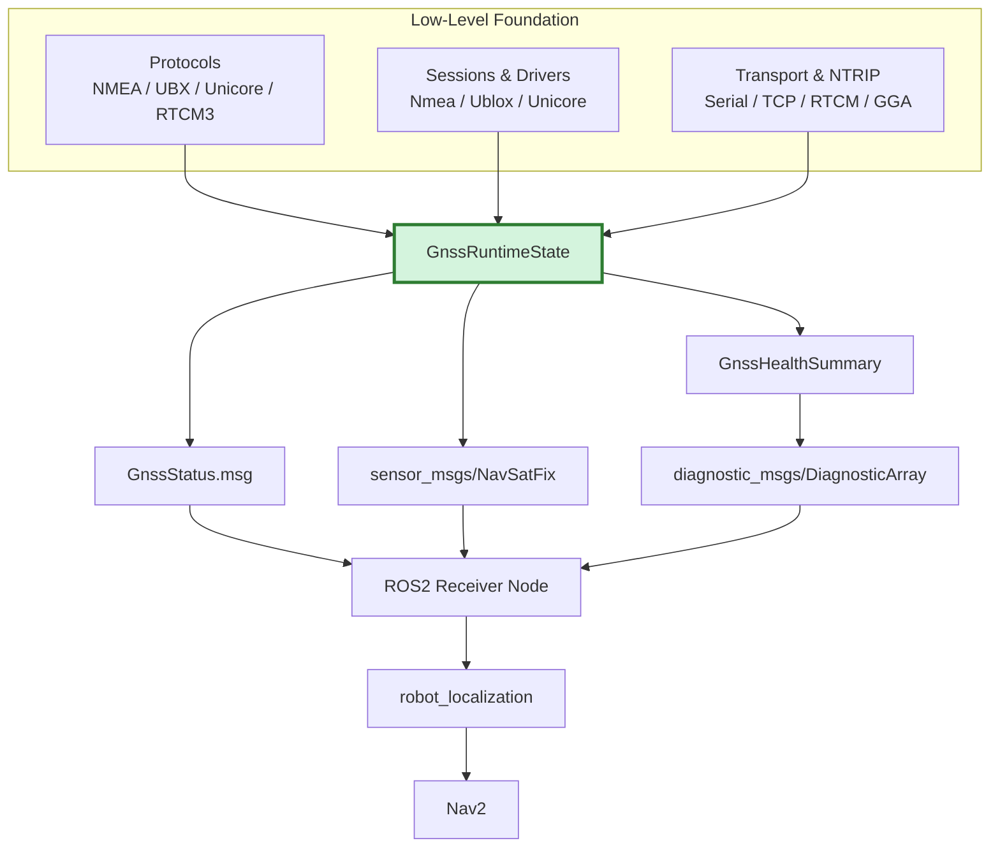

# ROS 2 Adapter Architecture

This document describes the current ROS 2 boundary for Universal GNSS.

Today the project contains two implemented layers:

- `gnss_core`: a portable, ROS-independent runtime model
- `gnss_ros2`: the ROS 2 package `universal_gnss_ros2`

The low-level stack is now implemented in sibling packages:

- `gnss_protocols`: NMEA, UBX/u-blox, Unicore, and RTCM parsing
- `gnss_driver`: receiver sessions, drivers, command/config plumbing
- `gnss_transport`: memory, POSIX serial, and TCP transport adapters
- `gnss_ntrip`: NTRIP request/auth/client foundations

Those layers are intentionally separate from `gnss_ros2`.

## Purpose

`universal_gnss_ros2` exists to project the portable `gnss_core` model into
standard ROS 2 types and messages without teaching the core about ROS.

Current responsibilities:

- expose a typed ROS 2 status message: `universal_gnss_ros2/msg/GnssStatus`
- convert `universal_gnss::GnssRuntimeState` to `GnssStatus`
- convert `universal_gnss::GnssRuntimeState` to `sensor_msgs/msg/NavSatFix`
- convert portable `GnssHealthSummary` / `GnssDiagnosticEvent` values into
  `diagnostic_msgs`
- provide a minimal `ReceiverNode` that composes the existing low-level
  sessions, transports, runner, and adapters into standard ROS 2 publishers

Current non-responsibilities:

- parsing NMEA, RTCM, UBX, Unicore, or any vendor protocol
- receiver-specific protocol logic
- receiver configuration ownership
- backend-specific fix inference
- NTRIP transport ownership
- downstream integration packages

## Layer Split

The intended boundary is:



`gnss_core` is ROS-independent on purpose:

- it must stay portable to Linux and embedded targets such as ESP32
- it must not depend on ROS clocks, headers, or message packages
- it should remain reusable in non-ROS runtimes and test tools

`gnss_ros2` is where ROS-specific policies belong:

- message layout choices
- timestamp conversion to `builtin_interfaces/Time`
- `NavSatFix` status mapping
- covariance projection policy
- diagnostic-array projection policy
- ROS node-facing parameter and publisher policies

## Typed Runtime State Philosophy

The core runtime state is the normalized contract between future parsers,
drivers, tools, and adapters.

Design goals:

- represent GNSS state with simple standard C++ types
- keep the model backend-agnostic
- distinguish "unsupported", "supported but currently unknown", and "known"
- avoid leaking vendor strings or receiver-specific hacks into public contracts

The runtime state is intentionally richer than `NavSatFix`. For example:

- RTK mode is explicit
- heading can exist independently of position quality
- CN0, satellite counts, and correction age are first-class optional values

This lets future drivers normalize richer receiver telemetry before any ROS
projection happens.

## Capability And Value Flags

`GnssStatus` exists because `NavSatFix` cannot express enough normalized GNSS
runtime information by itself.

The contract uses two flag sets with the same bit assignments:

- `capability_flags`: which optional fields this runtime path can provide at all
- `value_flags`: which optional fields have a current value in this sample

This gives four useful states:

```text
capability=0, value=0 -> unsupported / unavailable on this path
capability=1, value=0 -> supported but no current value
capability=1, value=1 -> current value is present
```

For boolean fields this becomes:

```text
capability=1, value=1, field=false -> known false
capability=1, value=1, field=true  -> known true
```

## Invariant Rules

The core and ROS 2 adapter both rely on one strict invariant:

```text
value_flags must never contain a bit that is absent from capability_flags
```

Meaning:

- adapters must not claim a value for an unsupported field
- producers must not set a value flag unless the corresponding optional field is
  actually present
- consumers may safely interpret `capability=0` as "do not expect this field"

The ROS 2 status adapter preserves this invariant and asserts against invalid
core state in debug builds.

## GnssStatus Contract

`universal_gnss_ros2/msg/GnssStatus` is the ROS 2 projection of the normalized
runtime state.

Always-present fields:

- `stamp`
- `fix_valid`
- `fix_type`
- `rtk_mode`
- `capability_flags`
- `value_flags`

Coordinate fields:

- `latitude_deg`
- `longitude_deg`
- `altitude_m`

These are not capability-gated today. They are direct runtime values and use
`NaN` when unavailable.

Capability-gated optional fields:

- horizontal / vertical accuracy
- HDOP / VDOP
- satellites used / visible / tracked
- mean / max CN0
- correction age
- heading
- dual antenna heading state
- interference state
- jamming state

Semantics:

- unsupported: capability bit is clear
- supported but unknown right now: capability bit set, value bit clear
- known value: capability bit set, value bit set

Unknown vs unsupported matters:

- `rtk_mode = UNKNOWN` with no capability bit means the path does not expose RTK mode
- `rtk_mode = UNKNOWN` with the capability bit set means RTK mode exists in the
  model but is not known for this sample

Timestamp semantics:

- the core stores an optional `timestamp_ns`
- the ROS 2 adapter converts it to `builtin_interfaces/Time`
- absent timestamps map to zero ROS time

Heading semantics:

- heading is just a normalized optional field
- it does not imply RTK-fixed position quality
- dual-antenna heading availability is tracked separately from numeric heading

Backend-agnostic guarantee:

- `GnssStatus` does not encode vendor names or backend aliases
- no field depends on a specific receiver family
- no parser-specific string parsing is required to consume the message

## Why Diagnostics Parsing Is Not In Adapters

Adapters are intentionally dumb projections from normalized runtime state into
ROS types.

Diagnostics parsing does not belong here because it would:

- couple ROS adapters to ad hoc text keys or vendor formats
- blur the line between normalization and transport
- make the ROS layer own backend-specific logic

That parsing/normalization logic belongs in the low-level stack:

- `gnss_protocols`: typed protocol parsing
- `gnss_driver`: receiver-family normalization and runtime mapping
- `gnss_ntrip`: correction transport and caster-facing behavior

## NavSatFix Adapter Policy

`sensor_msgs/msg/NavSatFix` remains useful for compatibility with the broader
ROS ecosystem, but it is a lossy projection of the typed runtime model.

### Status mapping

Current policy:

- missing coordinates, invalid fix, `UNKNOWN`, or `NO_FIX` -> `STATUS_NO_FIX`
- valid non-fixed solutions -> `STATUS_FIX`
- explicit RTK fixed only -> `STATUS_GBAS_FIX`

This is intentionally conservative.

Why `STATUS_GBAS_FIX` is conservative:

- many real systems overload `NavSatStatus` in backend-specific ways
- Universal GNSS should not claim RTK-fixed certainty unless the normalized
  runtime state says so explicitly
- RTK float remains `STATUS_FIX`, not a stronger code

### Covariance policy

Covariance is optional.

Current rule:

- if both horizontal and vertical accuracy are present, publish a diagonal
  approximated covariance using `sigma^2`
- otherwise keep covariance type `UNKNOWN`

Why this is conservative:

- the core exposes scalar accuracy, not a full ellipsoid or full covariance matrix
- partial precision is not fabricated
- missing accuracy does not become fake "good enough" covariance

### frame_id policy

`frame_id` is intentionally left empty.

Reason:

- the portable core does not carry ROS frame semantics
- inventing a frame like `gps_link` in the adapter would be a policy decision
  that belongs in a higher ROS node if needed

### service bits policy

`NavSatStatus.service` is left at `0`.

Reason:

- the core currently does not model constellation/service provenance
- inferring service bits from thin runtime state would be guesswork

### RTK truth policy

RTK truth does not come from `NavSatFix` alone.

`NavSatFix` is treated as a compatibility output, not the authoritative runtime
model. The authoritative model is `GnssRuntimeState`, and the richer ROS view is
`GnssStatus`.

## Mapping Audit

The current field-by-field ROS projection contract lives in
[docs/ros2_mapping.md](ros2_mapping.md).

That document records:

- every `GnssRuntimeState` field and whether it reaches `GnssStatus`,
  `NavSatFix`, or ROS diagnostics helpers
- current intentional omissions such as semantic-only `VTG` / `ZDA`
- distro-compatibility assumptions for Humble, Jazzy, and Kilted

The same audit document also records the exact local Kilted build/test method
used for `universal_gnss_ros2` validation in the MowgliNext development image.

## Receiver Node

`universal_gnss_ros2` now includes a first minimal receiver node skeleton:

- class: `universal_gnss_ros2::ReceiverNode`
- executable: `receiver_node`

The node is intentionally thin. It does not parse raw protocols itself. It
composes the existing low-level path:

```text
ByteSource -> ReceiverSessionRunner -> ReceiverSession -> GnssRuntimeState
           -> ROS adapters -> ROS 2 publishers
```

### Inputs

Supported transport parameters:

- `transport=serial`
- `transport=tcp`

Supported receiver families:

- `receiver_family=auto`
- `receiver_family=nmea`
- `receiver_family=ublox`
- `receiver_family=unicore`

### Parameters

- `receiver_family`
- `transport`
- `serial_device`
- `serial_baud`
- `tcp_host`
- `tcp_port`
- `publish_rate_hz`
- `frame_id`

### Outputs

Topics published by the skeleton node:

- `fix`
  - type: `sensor_msgs/msg/NavSatFix`
- `status`
  - type: `universal_gnss_ros2/msg/GnssStatus`
- `diagnostics`
  - type: `diagnostic_msgs/msg/DiagnosticArray`

The minimal launch examples now installed with the package are:

- `receiver_serial.launch.py`
- `receiver_tcp.launch.py`

They are intentionally parameter-forwarding wrappers around `receiver_node`.

### Example invocation

Serial u-blox example:

```bash
ros2 run universal_gnss_ros2 receiver_node --ros-args \
  -p receiver_family:=ublox \
  -p transport:=serial \
  -p serial_device:=/dev/ttyACM0 \
  -p serial_baud:=921600 \
  -p frame_id:=gnss
```

TCP generic-NMEA example:

```bash
ros2 run universal_gnss_ros2 receiver_node --ros-args \
  -p receiver_family:=nmea \
  -p transport:=tcp \
  -p tcp_host:=127.0.0.1 \
  -p tcp_port:=2101 \
  -p frame_id:=gnss
```

Launch-file equivalents:

```bash
ros2 launch universal_gnss_ros2 receiver_serial.launch.py \
  serial_device:=/dev/ttyACM0 \
  serial_baud:=921600 \
  receiver_family:=unicore

ros2 launch universal_gnss_ros2 receiver_serial.launch.py \
  serial_device:=/dev/ttyUSB0 \
  serial_baud:=115200 \
  receiver_family:=ublox

ros2 launch universal_gnss_ros2 receiver_tcp.launch.py \
  tcp_host:=127.0.0.1 \
  tcp_port:=2101
```

### Current limits

- no NTRIP ownership yet
- no `robot_localization` / Nav2 integration yet
- no receiver command/config ownership yet
- no retry/reconnect lifecycle node yet

## What Comes Next

The next ROS 2 phase is still higher-level integration, not more low-level
feature work:

- NTRIP node
- replay node
- launch/examples
- downstream integration surfaces such as `robot_localization` / Nav2
