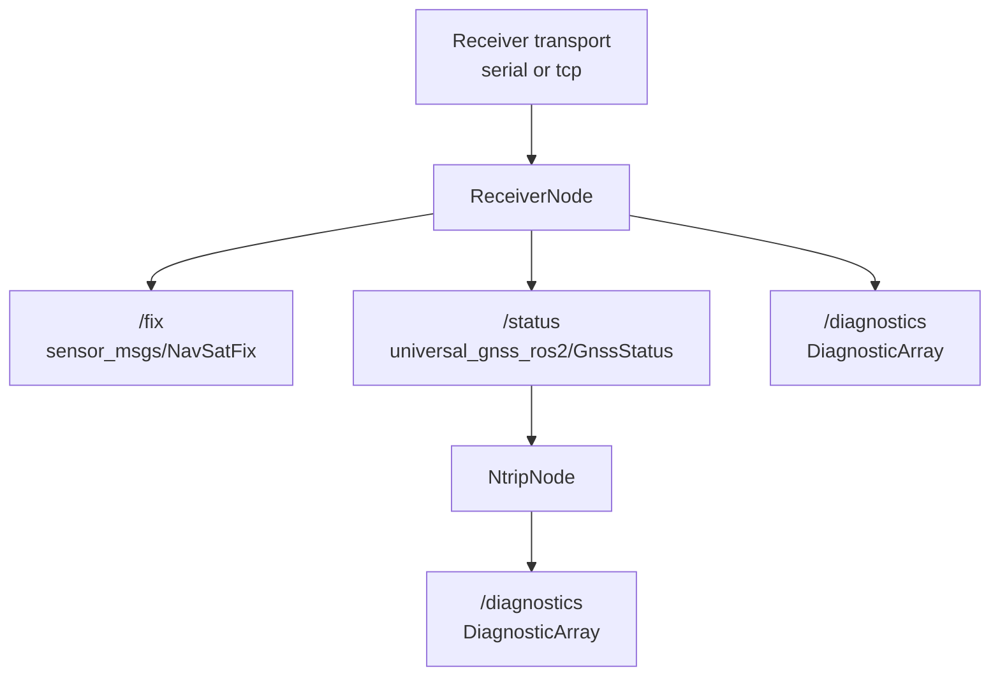

# ROS2 End-to-End Audit

This document records the current ROS2 end-to-end status for the Universal
GNSS runtime path.

Scope:

- `ReceiverNode`
- `NtripNode`
- launch examples
- ROS2 topic and diagnostics behavior
- combined receiver + NTRIP bringup

This audit intentionally stops short of:

- Nav2
- GUI
- lifecycle/composition conversion
- ESP32 / LoRa / RTK base gateway work

## Data Path

Current intended path:



Low-level ownership remains unchanged:

- `gnss_driver` owns receiver-session logic
- `gnss_transport` owns byte transport
- `gnss_ntrip` owns the reusable NTRIP client, reconnect policy, GGA injection,
  and RTCM monitoring
- `gnss_ros2` owns ROS parameters, timers, subscriptions, publishers, and
  diagnostics projection

## Receiver Node Audit

### Inputs

Supported parameters:

- `receiver_family`: `auto`, `nmea`, `ublox`, `unicore`
- `transport`: `serial`, `tcp`
- `serial_device`
- `serial_baud`
- `tcp_host`
- `tcp_port`
- `publish_rate_hz`
- `frame_id`

Supported runtime sources:

- real serial byte source
- real TCP byte source
- injected / scripted byte sources in tests

### Outputs

Published topics:

- `/fix`
  - `sensor_msgs/msg/NavSatFix`
- `/status`
  - `universal_gnss_ros2/msg/GnssStatus`
- `/diagnostics`
  - `diagnostic_msgs/msg/DiagnosticArray`

### Behavior verified without hardware

- valid NMEA runtime updates produce both `/fix` and `/status`
- `frame_id` is propagated into `NavSatFix` and diagnostics
- semantic-only `VTG` / `ZDA` input does not invent runtime fix data
- invalid `receiver_family`, `publish_rate_hz`, and empty `frame_id` fail
  cleanly at startup
- no-data grace period produces diagnostics
- stale / disconnected runtime suppresses stale `/fix` publication
- transport read failures and startup open failures surface as diagnostics while
  keeping the node alive where reasonable

### Failure behavior

- startup parameter mistakes fail fast with explicit ROS error logs
- runtime transport failures keep the node alive and surface via diagnostics
- stale runtime state suppresses new `/fix` output
- `/status` and `/diagnostics` remain publishable even when `/fix` is withheld

## NTRIP Node Audit

### Inputs

Subscription:

- `/status`
  - `universal_gnss_ros2/msg/GnssStatus`

Supported parameters:

- `caster_host`
- `caster_port`
- `mountpoint`
- `username`
- `password`
- `gga_enabled`
- `gga_interval_s`
- `tls_enabled`

### Outputs

Published topics:

- `/diagnostics`
  - `diagnostic_msgs/msg/DiagnosticArray`

### Behavior verified without hardware

- reverse mapping from `GnssStatus` back to `GnssRuntimeState` works for GGA
  source use
- request generation and streaming transition reuse the existing low-level
  `NtripClient`
- GGA is forwarded only when a valid, fresh runtime state exists
- missing status prevents GGA injection and surfaces `gga_source_missing`
- stale status prevents GGA injection and surfaces `gga_source_stale`
- disconnect transitions surface `ntrip_reconnecting`
- correction-monitor and transport diagnostics are projected through
  `diagnostic_msgs`

### Failure behavior

- invalid parameters fail fast
- `tls_enabled=true` is rejected because TLS is still unsupported
- the node configures the wrapped TCP client nonblocking so periodic ROS timers
  cannot hang on blocking socket reads
- caster disconnects are reported without crashing the node

## Combined Launch Audit

Installed launch files:

- `receiver_serial.launch.py`
- `receiver_tcp.launch.py`
- `ntrip.launch.py`
- `receiver_and_ntrip.launch.py`

`receiver_and_ntrip.launch.py` is intentionally simple:

- starts `receiver_node`
- starts `ntrip_node`
- forwards explicit parameters for both
- does not include `robot_localization`, Nav2, lifecycle behavior, or NTRIP
  correction forwarding

Launch syntax was validated with:

```bash
python3 -m py_compile \
  gnss_ros2/launch/receiver_serial.launch.py \
  gnss_ros2/launch/receiver_tcp.launch.py \
  gnss_ros2/launch/ntrip.launch.py \
  gnss_ros2/launch/receiver_and_ntrip.launch.py
```

## Real Hardware Smoke Test

### Requested device

- u-blox ZED-F9P on `/dev/ttyACM0`

### Result

Hardware smoke tests were not run in this environment because `/dev/ttyACM0`
was not present at audit time.

Observed check:

```bash
ls -l /dev/ttyACM0
```

Result:

- `No such file or directory`

Because the device was absent, the audit stayed read-only and did not attempt:

- baud probing
- receiver configuration reads
- temporary receiver reconfiguration

### Manual smoke-test commands when hardware is available

u-blox:

```bash
ros2 launch universal_gnss_ros2 receiver_serial.launch.py \
  serial_device:=/dev/ttyACM0 \
  serial_baud:=115200 \
  receiver_family:=ublox
```

Unicore:

```bash
ros2 launch universal_gnss_ros2 receiver_serial.launch.py \
  serial_device:=/dev/ttyUSB0 \
  serial_baud:=921600 \
  receiver_family:=unicore
```

Generic NMEA:

```bash
ros2 launch universal_gnss_ros2 receiver_serial.launch.py \
  serial_device:=/dev/ttyUSB0 \
  receiver_family:=nmea
```

Combined receiver + NTRIP:

```bash
ros2 launch universal_gnss_ros2 receiver_and_ntrip.launch.py \
  receiver_family:=ublox \
  transport:=serial \
  serial_device:=/dev/ttyACM0 \
  serial_baud:=115200 \
  caster_host:=127.0.0.1 \
  caster_port:=2101 \
  mountpoint:=RTCM3 \
  gga_enabled:=true
```

Useful checks:

```bash
ros2 topic echo /status --once
ros2 topic echo /fix --once
ros2 topic echo /diagnostics --once
ros2 topic hz /status
ros2 topic hz /fix
```

Optional low-level serial smoke test before ROS2:

```bash
./build/gnss_tools/gnss_serial_monitor \
  --port /dev/ttyACM0 \
  --baud 115200 \
  --vendor ublox
```

## Test Coverage Added In This Audit

ROS2-side additions:

- combined receiver + NTRIP node construction
- missing `/status` prevents GGA injection
- stale `/status` prevents GGA injection
- combined launch syntax coverage by Python compile check

Key ROS2 tests now covering the end-to-end path:

- `test_receiver_node`
- `test_ntrip_node`
- `test_gnss_status_adapter`
- `test_navsat_fix_adapter`
- `test_diagnostic_adapter`

## Validation Summary

### Host validation

Ran:

```bash
cmake -S . -B build
cmake --build build
ctest --test-dir build --output-on-failure
```

Result:

- `58/58` tests passed

### Kilted ROS2 validation

Ran in the local Kilted container workflow:

```bash
colcon build --packages-select universal_gnss_ros2
colcon test --packages-select universal_gnss_ros2
colcon test-result --verbose
```

Result:

- `universal_gnss_ros2` built successfully
- `5/5` ROS2 package tests passed
- `43` ROS2 gtest cases passed

Known note:

- Kilted still emits the already-known `ament_target_dependencies()`
  deprecation warnings

## Audit Verdict

Current ROS2 end-to-end status is good enough for continued ROS2 phase work:

- receiver input -> `/fix` / `/status` / `/diagnostics` is covered
- `/status` -> `NtripNode` -> diagnostics is covered
- stale GNSS input no longer leaks into repeated GGA injection
- combined bringup exists for manual operator testing

## Remaining Blockers Before A `v0.5` Tag

- real hardware ROS2 smoke tests still need to be rerun when a device is
  actually present
- no RTCM forwarding path from `NtripNode` into a live receiver path yet
- no ROS2 replay node yet
- no Humble / Jazzy package validation yet
- no ROS2 CI matrix yet
- Kilted linkage modernization is still deferred
