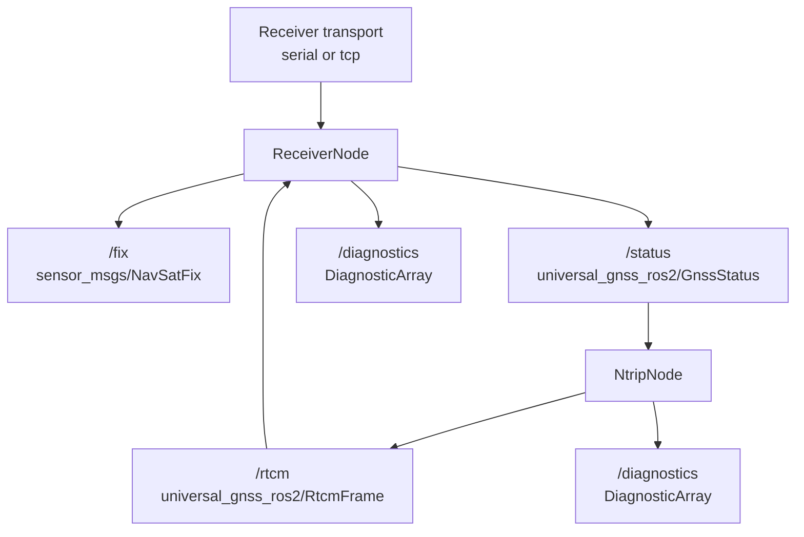

# ROS2 End-to-End Audit

This document records the current ROS2 end-to-end status for the Universal
GNSS runtime path.

Scope:

- `ReceiverNode`
- `NtripNode`
- launch examples
- ROS2 topic and diagnostics behavior
- combined receiver + NTRIP bringup

This audit intentionally stops short of:

- Nav2
- GUI
- lifecycle/composition conversion
- ESP32 / LoRa / RTK base gateway work

## Data Path

Current intended path:



Low-level ownership remains unchanged:

- `gnss_driver` owns receiver-session logic
- `gnss_transport` owns byte transport
- `gnss_ntrip` owns the reusable NTRIP client, reconnect policy, GGA injection,
  and RTCM monitoring
- `gnss_ros2` owns ROS parameters, timers, subscriptions, publishers, and
  diagnostics projection

## Receiver Node Audit

### Inputs

Supported parameters:

- `receiver_family`: `auto`, `nmea`, `ublox`, `unicore`
- `transport`: `serial`, `tcp`
- `serial_device`
- `serial_baud`
- `tcp_host`
- `tcp_port`
- `publish_rate_hz`
- `frame_id`

Supported runtime sources:

- real serial byte source
- real TCP byte source
- injected / scripted byte sources in tests
- `/rtcm`
  - `universal_gnss_ros2/msg/RtcmFrame`
  - consumed as correction input and written back to the active receiver
    transport when that transport is writable

### Outputs

Published topics:

- `/fix`
  - `sensor_msgs/msg/NavSatFix`
- `/status`
  - `universal_gnss_ros2/msg/GnssStatus`
- `/diagnostics`
  - `diagnostic_msgs/msg/DiagnosticArray`

### Behavior verified without hardware

- valid NMEA runtime updates produce both `/fix` and `/status`
- `frame_id` is propagated into `NavSatFix` and diagnostics
- semantic-only `VTG` / `ZDA` input does not invent runtime fix data
- invalid `receiver_family`, `publish_rate_hz`, and empty `frame_id` fail
  cleanly at startup
- no-data grace period produces diagnostics
- stale / disconnected runtime suppresses stale `/fix` publication
- transport read failures and startup open failures surface as diagnostics while
  keeping the node alive where reasonable

### Failure behavior

- startup parameter mistakes fail fast with explicit ROS error logs
- runtime transport failures keep the node alive and surface via diagnostics
- stale runtime state suppresses new `/fix` output
- `/status` and `/diagnostics` remain publishable even when `/fix` is withheld

## NTRIP Node Audit

### Inputs

Subscription:

- `/status`
  - `universal_gnss_ros2/msg/GnssStatus`

Supported parameters:

- `caster_host`
- `caster_port`
- `mountpoint`
- `username`
- `password`
- `gga_enabled`
- `gga_interval_s`
- `tls_enabled`

### Outputs

Published topics:

- `/rtcm`
  - `universal_gnss_ros2/msg/RtcmFrame`
- `/diagnostics`
  - `diagnostic_msgs/msg/DiagnosticArray`

### Behavior verified without hardware

- reverse mapping from `GnssStatus` back to `GnssRuntimeState` works for GGA
  source use
- request generation and streaming transition reuse the existing low-level
  `NtripClient`
- GGA is forwarded only when a valid, fresh runtime state exists
- missing status prevents GGA injection and surfaces `gga_source_missing`
- stale status prevents GGA injection and surfaces `gga_source_stale`
- disconnect transitions surface `ntrip_reconnecting`
- correction-monitor and transport diagnostics are projected through
  `diagnostic_msgs`

### Failure behavior

- invalid parameters fail fast
- `tls_enabled=true` is rejected because TLS is still unsupported
- the node configures the wrapped TCP client nonblocking so periodic ROS timers
  cannot hang on blocking socket reads
- caster disconnects are reported without crashing the node

## Combined Launch Audit

Installed launch files:

- `receiver_serial.launch.py`
- `receiver_tcp.launch.py`
- `ntrip.launch.py`
- `receiver_and_ntrip.launch.py`

`receiver_and_ntrip.launch.py` is intentionally simple:

- starts `receiver_node`
- starts `ntrip_node`
- forwards explicit parameters for both
- relies on the built-in `rtcm` topic bridge for correction forwarding
- does not include `robot_localization`, Nav2, or lifecycle behavior

Launch syntax was validated with:

```bash
python3 -m py_compile \
  gnss_ros2/launch/receiver_serial.launch.py \
  gnss_ros2/launch/receiver_tcp.launch.py \
  gnss_ros2/launch/ntrip.launch.py \
  gnss_ros2/launch/receiver_and_ntrip.launch.py
```

## Real Hardware Smoke Test

### Device

- receiver: u-blox ZED-F9P
- path: `/dev/ttyACM0`
- audit date: 2026-06-02

### Host visibility and permissions

Observed:

```bash
ls -l /dev/ttyACM0
id
groups
ls -l /dev/serial/by-id
lsusb | rg 'u-blox'
```

Result:

- `/dev/ttyACM0` existed and resolved from `/dev/serial/by-id`
- host node permissions were `crw-rw---- root:dialout`
- the host user had `dialout` membership during the final smoke test, so
  host-side serial tools were usable directly
- the Kilted container path still worked cleanly because the container ran as
  `root` and was started with `--device=/dev/ttyACM0`

`dmesg` was not readable as the unprivileged host user, so it was not used for
the final result.

### Kilted container path used

Container:

- image: `universal-gnss-devcontainer-test`
- device passthrough: `--device=/dev/ttyACM0`

Validation inside the container:

```bash
source /opt/ros/kilted/setup.bash
mkdir -p /tmp/universal_gnss_ros2_ws/src
ln -s /workspaces/universal-gnss/gnss_ros2 /tmp/universal_gnss_ros2_ws/src/gnss_ros2
ln -s /workspaces/universal-gnss/gnss_core /tmp/universal_gnss_ros2_ws/src/gnss_core
cd /tmp/universal_gnss_ros2_ws
colcon build --packages-select universal_gnss_ros2
colcon test --packages-select universal_gnss_ros2
colcon test-result --verbose
```

Result:

- `universal_gnss_ros2` built successfully
- `47` ROS2 tests passed with `0` errors and `0` failures

### Real caster discovered and validated

Using the supplied mountpoint and credentials, the live caster endpoint was
identified on the local LAN as:

- host: `192.168.10.31`
- port: `2101`
- mountpoint: `PEPEUCHGNSS`

Credentials are intentionally omitted from this document. The validation used
the operator-supplied username/password pair.

### Baud probing

Tested:

- `115200`
- `38400`
- `921600`

Read-only probe used:

```bash
./build/gnss_tools/gnss_serial_monitor \
  --port /dev/ttyACM0 \
  --baud <baud> \
  --vendor ublox \
  --summary \
  --max-bytes 1024
```

Result:

- all three tested baud values produced valid UBX traffic and valid runtime
  updates
- on this USB CDC ACM path, the configured tty baud behaved as a host-side
  parameter only
- `921600` is now the preferred reference validation configuration for future
  ROS2 receiver and RTCM-forwarding tests

Example summary at `921600`:

```text
Summary:
  port=/dev/ttyACM0 baud=921600 vendor=ublox
  selected_session=ublox bytes_read=8284 chunks_read=73 runtime_updates=42
  eof_seen=false read_errors=0 malformed_records=0 unknown_records=2 last_status=ok last_error=none
  final_state: session=ublox fix_valid=true fix_type=fix rtk_mode=none lat_deg=43.954291100 lon_deg=2.202346600 alt_m=168.629 h_acc_m=0.608 v_acc_m=0.850 hdop=0.56 vdop=0.83 sats_used=29 sats_visible=49 cn0_mean_db_hz=35.3 cn0_max_db_hz=48.0
```

### Receiver output observed

Read-only byte capture plus `gnss_inspect` showed:

```text
ubx_messages 01:07=10
```

Meaning:

- the current USB output stream was `UBX-NAV-PVT`
- no `NAV-SAT`, `NAV-DOP`, `MON-RF`, or `MON-HW` messages were observed in the
  sampled capture
- this explains why `/status` exposed position and scalar accuracy but did not
  expose DOP, CN0, or visible/tracked satellite counts during this smoke test

### Hardware-path gap found and fixed

The first real-hardware pass exposed one low-level configuration gap:

- the built-in u-blox diagnostics profile only enabled message outputs on
  `UART1`
- applying that profile to a USB-attached ZED-F9P therefore would not have
  enriched the current `/dev/ttyACM0` stream

Fix applied:

- [gnss_protocols/include/universal_gnss_protocols/ubx_cfg_builder.hpp](../gnss_protocols/include/universal_gnss_protocols/ubx_cfg_builder.hpp)
  now includes the documented USB `CFG-MSGOUT-*` keys used in this audit
- [gnss_driver/src/ublox_config_profile_builder.cpp](../gnss_driver/src/ublox_config_profile_builder.cpp)
  now emits both `UART1` and `USB` output-rate commands for the rover, base,
  and diagnostics helpers
- the affected u-blox config/profile tests were updated accordingly

### Runtime-only receiver configuration used for validation

To validate the richer ROS2 status path without making persistent receiver
changes, the following runtime-only profile was applied:

```bash
./build/gnss_tools/gnss_config_apply \
  ublox diagnostics \
  --port /dev/ttyACM0 \
  --baud 921600 \
  --execute \
  --confirm-runtime \
  --json
```

Observed result:

- `23/23` commands completed successfully
- the profile targeted `CFG-RAM` only
- no persistent save/config command was issued

Effective output set enabled for the smoke test:

- `UBX-NAV-PVT`
- `UBX-NAV-SAT`
- `UBX-NAV-STATUS`
- `UBX-NAV-DOP`
- `UBX-MON-HW`
- `UBX-MON-HW2`
- `UBX-MON-RF`
- `UBX-RXM-RTCM`
- `NMEA-GGA`

Restore note:

- because this was a runtime-only `CFG-RAM` apply, a receiver reboot or
  factory reset is sufficient to clear the temporary message-output changes

### Receiver output observed after runtime configuration

Post-config capture plus `gnss_inspect` showed:

```text
ubx_messages 01:03=5 01:04=5 01:07=6 01:35=5 0A:09=1 0A:0B=1 0A:38=1
```

Meaning:

- `NAV-PVT`, `NAV-SAT`, `NAV-STATUS`, and `NAV-DOP` were flowing on USB
- `MON-HW`, `MON-HW2`, and `MON-RF` were also present
- the runtime path now had enough data to validate DOP, visible satellites,
  CN0, and receiver RF/hardware diagnostics flow through ROS2

### ROS2 receiver smoke test

Launch command used:

```bash
ros2 launch universal_gnss_ros2 receiver_serial.launch.py \
  serial_device:=/dev/ttyACM0 \
  serial_baud:=921600 \
  receiver_family:=ublox
```

Observed topics:

- `/status`
- `/fix`
- `/diagnostics`

Observed `/status` values after the timestamp fix (`ros2 topic echo /status --once`
capture, with geodetic fields reformatted here to 9 decimal places for
consistency with Universal GNSS text/JSON surfaces):

```text
stamp:
  sec: 1780387316
  nanosec: 630151336
fix_valid: true
fix_type: 2
rtk_mode: 1
capability_flags: 25471
value_flags: 895
latitude_deg: 43.954275900
longitude_deg: 2.202380400
altitude_m: 171.577
horizontal_accuracy_m: 0.32199999690055847
vertical_accuracy_m: 0.492000013589859
hdop: 0.5099999904632568
vdop: 0.7899999618530273
satellites_used: 32
satellites_visible: 41
mean_cn0_db_hz: 37.894737243652344
max_cn0_db_hz: 48.0
interference_detected: false
jamming_detected: false
```

Observed `ros2 topic echo /fix --once`:

- `header.stamp` was non-zero
- `frame_id=gnss_link`
- `status.status=0`
- diagonal covariance was populated from scalar accuracy

Observed `ros2 topic echo /diagnostics --once`:

- `universal_gnss/summary`
- `overall_severity=ok`
- `fix_valid=true`
- `transport_healthy=true`
- `parser_healthy=true`
- `stale_data=false`
- `event_count=0`
- `event_count=0` was expected in this run because `MON-HW` / `MON-RF`
  reported healthy receiver state rather than warning/error conditions

Observed rates:

- `/status`: `5.000 Hz`
- `/fix`: `5.000 Hz`

### Smoke-test bug found and fixed

The first live run revealed one ROS2 bug:

- `GnssStatus.stamp` was zero on live serial data because the receiver node did
  not fill a ROS timestamp when the low-level runtime sample lacked
  `timestamp_ns`

Fix applied:

- [gnss_ros2/src/receiver_node.cpp](../gnss_ros2/src/receiver_node.cpp)
  now stamps outgoing live publications with `node->now()` when the runtime
  sample has no timestamp
- [gnss_ros2/tests/test_receiver_node.cpp](../gnss_ros2/tests/test_receiver_node.cpp)
  now asserts non-zero stamps for `fix`, `status`, and `diagnostics`

One false intermediate reading came from a stale older `receiver_node` process
that was still running in the test container after a manual relaunch. After the
stale process was terminated, `/status` also showed the expected non-zero
timestamp.

### Real UM982 ROS2 receiver smoke test

Receiver:

- model: Unicore UM982
- path: `/dev/ttyUSB0`
- baud: `921600`
- audit date: 2026-06-02

Receiver-only launch used:

```bash
ros2 launch universal_gnss_ros2 receiver_serial.launch.py \
  serial_device:=/dev/ttyUSB0 \
  serial_baud:=921600 \
  receiver_family:=unicore
```

Observed `/status`:

- `fix_valid=true`
- valid lat/lon/alt
- `horizontal_accuracy_m` and `vertical_accuracy_m` present
- `hdop` present
- `satellites_used=25`
- `satellites_tracked=30`
- `correction_age_s=0.0`

Observed `/fix`:

- non-zero stamp
- `frame_id=gnss_link`
- covariance populated

Observed `/diagnostics` after the Unicore-specific fix below:

- `universal_gnss/summary`
- `overall_severity=ok`
- `transport_healthy=true`
- `parser_healthy=true`
- `stale_data=false`
- `correction_available=true`
- `event_count=0`

Observed rates:

- `/status`: `5.000 Hz`
- `/fix`: `5.000 Hz`

#### UM982 bug found and fixed

The first UM982 live attach produced one false parser warning:

- `parser_healthy=false`
- one startup malformed record

Root cause:

- `UnicoreSession` permanently counted one initial malformed line or binary
  frame when the node attached in the middle of an already-running mixed
  ASCII/binary stream

Fix applied:

- [gnss_driver/src/unicore_session.cpp](../gnss_driver/src/unicore_session.cpp)
  now suppresses one startup resynchronization malformed event separately for
  the ASCII and binary framers until each framer has seen its first valid
  record
- [gnss_driver/tests/test_unicore_session.cpp](../gnss_driver/tests/test_unicore_session.cpp)
  now covers startup invalid-binary suppression, startup ASCII overflow
  suppression, and the unchanged post-sync/finalize malformed behavior

### Manual smoke-test commands when hardware is available

u-blox:

```bash
ros2 launch universal_gnss_ros2 receiver_serial.launch.py \
  serial_device:=/dev/ttyACM0 \
  serial_baud:=921600 \
  receiver_family:=ublox
```

Unicore:

```bash
ros2 launch universal_gnss_ros2 receiver_serial.launch.py \
  serial_device:=/dev/ttyUSB0 \
  serial_baud:=921600 \
  receiver_family:=unicore
```

Generic NMEA:

```bash
ros2 launch universal_gnss_ros2 receiver_serial.launch.py \
  serial_device:=/dev/ttyUSB0 \
  receiver_family:=nmea
```

Combined receiver + NTRIP:

```bash
ros2 launch universal_gnss_ros2 receiver_and_ntrip.launch.py \
  receiver_family:=ublox \
  transport:=serial \
  serial_device:=/dev/ttyACM0 \
  serial_baud:=921600 \
  caster_host:=127.0.0.1 \
  caster_port:=2101 \
  mountpoint:=RTCM3 \
  gga_enabled:=true
```

Useful checks:

```bash
ros2 topic echo /status --once
ros2 topic echo /fix --once
ros2 topic echo /diagnostics --once
ros2 topic hz /status
ros2 topic hz /fix
```

Optional low-level serial smoke test before ROS2:

```bash
./build/gnss_tools/gnss_serial_monitor \
  --port /dev/ttyACM0 \
  --baud 921600 \
  --vendor ublox
```

### Real NTRIP caster validation

Low-level caster validation command:

```bash
./build/gnss_tools/gnss_ntrip_monitor \
  --host 192.168.10.31 \
  --port 2101 \
  --mountpoint PEPEUCHGNSS \
  --user <redacted> \
  --password <redacted> \
  --max-seconds 8 \
  --summary
```

Observed result after the legacy-`ICY` compatibility fix:

```text
Summary:
  endpoint=192.168.10.31:2101/PEPEUCHGNSS state=streaming stop_reason=max_seconds
  bytes_received=14060 bytes_sent=198 request_sent=true response_received=true elapsed_s=8.389
  rtcm_frames_seen=60 valid_frames=60 invalid_frames=0 gga_sent=0 gga_send_errors=0 reconnects=0 last_type=1006
  base_position_seen=true base_1005_seen=true base_1006_seen=true glonass_bias_1230_seen=true
  correction_health=ok correction_available=true stale_data=false last_error=none
  message_types 1005=9 1006=9 1033=1 1077=8 1087=8 1097=8 1127=16 1230=1
  msm_constellations gps=8 glonass=8 galileo=8 beidou=16
  response_status ICY 200 OK
```

This validated:

- authentication and mountpoint access
- RTCM streaming through the reusable `NtripClient`
- RTCM frame extraction and correction-monitor metrics
- `1005`, `1006`, `1033`, `1077`, `1087`, `1097`, `1127`, and `1230`
  observation on the live stream
- base-position and GLONASS-bias presence tracking

### Real combined ROS2 receiver + NTRIP validation

Combined launch used:

```bash
ros2 launch universal_gnss_ros2 receiver_and_ntrip.launch.py \
  receiver_family:=ublox \
  transport:=serial \
  serial_device:=/dev/ttyACM0 \
  serial_baud:=921600 \
  caster_host:=192.168.10.31 \
  caster_port:=2101 \
  mountpoint:=PEPEUCHGNSS \
  username:=<redacted> \
  password:=<redacted> \
  gga_enabled:=true \
  gga_interval_s:=5
```

Observed `/rtcm` forwarding path:

- `/rtcm` existed and was published by `NtripNode`
- `NtripNode` diagnostics reported:
  - `published_frame_count=107`
  - `last_message_type=1127`
  - `last_frame_age_s≈0.399`
- `ReceiverNode` diagnostics reported:
  - `forwarded_frame_count=84`
  - `forwarded_bytes=22368`
  - `write_error_count=0`
  - `receiver_rtcm_messages_seen=44`
  - `receiver_rtcm_messages_used=44`
  - `receiver_rtcm_crc_failed=0`
  - `receiver_last_message_type=1006`

This is the first end-to-end proof that:

`NtripNode -> /rtcm -> ReceiverNode -> live serial transport -> u-blox RXM-RTCM`

Observed `/diagnostics` included:

- `universal_gnss_ntrip/summary`
  - `overall_severity=ok`
  - `correction_available=true`
  - `transport_healthy=true`
  - `parser_healthy=true`
- `universal_gnss_ntrip/ntrip_streaming`
  - `NTRIP correction stream is active`
- `universal_gnss_ntrip/rtcm.stream_active`
  - `RTCM correction stream is active`
- `universal_gnss_ntrip/gga_injection_active`
  - `NTRIP GGA injection is active`
- `universal_gnss/rtcm_forwarding`
  - `RTCM forwarding active`
  - `receiver_correction_available=true`
  - non-zero `receiver_rtcm_messages_used`

Observed `/status` remained valid at `5 Hz` while the NTRIP node was active:

- `fix_valid=true`
- `rtk_mode=fixed`
- `horizontal_accuracy_m≈0.046`
- `vertical_accuracy_m≈0.061`
- `hdop` and `vdop` present
- `satellites_visible` present
- `mean_cn0_db_hz` and `max_cn0_db_hz` present

This confirms the ROS2 path:

`ReceiverNode -> /status -> NtripNode -> /rtcm -> ReceiverNode -> live rover diagnostics`

### Real combined UM982 + NTRIP validation

Combined launch used:

```bash
ros2 launch universal_gnss_ros2 receiver_and_ntrip.launch.py \
  receiver_family:=unicore \
  transport:=serial \
  serial_device:=/dev/ttyUSB0 \
  serial_baud:=921600 \
  caster_host:=192.168.10.31 \
  caster_port:=2101 \
  mountpoint:=PEPEUCHGNSS \
  username:=<redacted> \
  password:=<redacted> \
  gga_enabled:=true \
  gga_interval_s:=5
```

Observed result:

- `/rtcm` published live RTCM frames
- `ros2 topic echo /rtcm --once` showed a valid `1005` frame
- `NtripNode` diagnostics reported:
  - `ntrip_streaming`
  - `rtcm.stream_active`
  - `rtcm_forwarding_active`
  - `gga_injection_active`
  - `published_frame_count=72`
  - `last_message_type=1127`
- `ReceiverNode` diagnostics reported:
  - `rtcm_forwarding_active`
  - `forwarded_frame_count=72`
  - `forwarded_bytes=21422`
  - `write_error_count=0`
  - `receiver_correction_available=true`
  - `last_message_type=1127`
  - `last_frame_age_s≈0.6`
- `GnssStatus` showed `correction_age_s=1.0`

The UM982 also surfaced live RF diagnostics through the existing portable path:

- `universal_gnss/interference_detected`
- `universal_gnss/jamming_detected`

These were treated as real receiver telemetry rather than adapter errors.

## Test Coverage Added In This Audit

ROS2-side additions:

- combined receiver + NTRIP node construction
- missing `/status` prevents GGA injection
- stale `/status` prevents GGA injection
- combined launch syntax coverage by Python compile check

Key ROS2 tests now covering the end-to-end path:

- `test_receiver_node`
- `test_ntrip_node`
- `test_gnss_status_adapter`
- `test_navsat_fix_adapter`
- `test_diagnostic_adapter`

## Validation Summary

### Host validation

Ran:

```bash
cmake -S . -B build
cmake --build build
ctest --test-dir build --output-on-failure
```

Result:

- `58/58` tests passed

### Kilted ROS2 validation

Ran in the local Kilted container workflow:

```bash
colcon build --packages-select universal_gnss_ros2
colcon test --packages-select universal_gnss_ros2
colcon test-result --verbose
```

Result:

- `universal_gnss_ros2` built successfully
- `5/5` ROS2 package tests passed
- `47` ROS2 gtest cases passed
- real ZED-F9P smoke test passed on `/dev/ttyACM0` using `receiver_family:=ublox`
- real UM982 smoke test passed on `/dev/ttyUSB0` using `receiver_family:=unicore`
- runtime-only USB diagnostics profile apply succeeded
- final sampled USB output included `NAV-PVT`, `NAV-SAT`, `NAV-STATUS`,
  `NAV-DOP`, `MON-HW`, `MON-HW2`, and `MON-RF`
- real local NTRIP caster validation passed on `192.168.10.31:2101/PEPEUCHGNSS`
- combined ROS2 receiver + NTRIP launch validated live correction streaming,
  active GGA injection, and live RTCM forwarding into the receiver transport
- live u-blox `RXM-RTCM` acceptance was observed through receiver diagnostics
- combined UM982 + NTRIP launch validated live correction forwarding through
  the same ROS2 architecture at `921600`

Known note:

- Kilted still emits the already-known `ament_target_dependencies()`
  deprecation warnings

## Audit Verdict

Current ROS2 end-to-end status is good enough for continued ROS2 phase work:

- receiver input -> `/fix` / `/status` / `/diagnostics` is covered
- `/status` -> `NtripNode` -> diagnostics is covered
- `/status` -> `NtripNode` -> real caster -> RTCM correction health is covered
- `/status` -> `NtripNode` -> `/rtcm` -> `ReceiverNode` -> live rover is covered
- stale GNSS input no longer leaks into repeated GGA injection
- combined bringup exists for manual operator testing

## Discovery Integration Note

The ROS2 receiver path now supports serial auto mode through the same portable,
read-only discovery foundation first introduced in the driver/tools layer.

That discovery layer provides:

- `DiscoverReceivers(...)` in `gnss_driver`
- `gnss_discover` in `gnss_tools`

`ReceiverNode` now consumes it when any of these serial parameters is set to
`auto`:

- `serial_device`
- `serial_baud`
- `receiver_family`

The underlying discovery layer was validated on the same real hardware used for
this ROS2 audit:

- `/dev/ttyACM0` detected as `ublox` at `921600`
- `/dev/ttyUSB0` detected as `unicore` at `921600`

Recommended operator flow today:

1. use explicit launch parameters when the path/family are already known
2. use `serial_device:=auto serial_baud:=auto receiver_family:=auto` when
   receiver discovery should happen inside `ReceiverNode`
3. use `gnss_discover` when an operator wants to inspect candidate ports and
   evidence before launching ROS2

### Real `ReceiverNode` auto-discovery smoke validation

The integrated ROS2 auto-discovery path was validated on the same Kilted
devcontainer workflow already used for the receiver and NTRIP hardware smoke
tests.

Portable discovery still reported both live receivers at `921600`:

- `/dev/serial/by-id/usb-u-blox_AG_-_www.u-blox.com_u-blox_GNSS_receiver-if00`
  -> `ublox`, confidence `high`
- `/dev/serial/by-id/usb-1a86_USB_Serial-if00-port0` -> `unicore`, confidence
  `high`

To make `serial_device:=auto` unambiguous during ROS2 validation, each smoke
run passed only one hardware device through the container:

- F9P run:
  - device exposed: `/dev/ttyACM0`
  - launch:
    `ros2 launch universal_gnss_ros2 receiver_serial.launch.py serial_device:=auto serial_baud:=auto receiver_family:=auto publish_rate_hz:=5.0`
  - discovery result: `/dev/ttyACM0`, `921600`, `ublox`, `high`
  - observed topics: `/status`, `/fix`, `/diagnostics`
  - observed rates: `/status ~= 5.0 Hz`, `/fix ~= 5.0 Hz`
- UM982 run:
  - device exposed: `/dev/ttyUSB0`
  - launch:
    `ros2 launch universal_gnss_ros2 receiver_serial.launch.py serial_device:=auto serial_baud:=auto receiver_family:=auto publish_rate_hz:=5.0`
  - discovery result: `/dev/ttyUSB0`, `921600`, `unicore`, `high`
  - observed topics: `/status`, `/fix`, `/diagnostics`
  - observed rates: `/status ~= 5.0 Hz`, `/fix ~= 5.0 Hz`

Both runs produced a healthy `universal_gnss/discovery` diagnostic with the
selected path, baud, family, confidence, and evidence summary.

Operator note:

- with one candidate receiver attached, `serial_device:=auto` is the simplest
  launch mode
- with multiple high-confidence receivers attached simultaneously, prefer an
  explicit `serial_device` or inspect candidates with `gnss_discover` first

For embedded Linux boards where the receiver is wired to an onboard UART, the
discovery layer also supports:

- `gnss_discover --include-platform-uarts`
- `gnss_discover --path /dev/ttyAMA2 --baud 921600`
- `ros2 launch universal_gnss_ros2 receiver_serial.launch.py serial_device:=auto serial_baud:=auto receiver_family:=auto discovery_include_platform_uarts:=true`

Onboard UART scanning stays opt-in because those ports may belong to serial
console, Bluetooth, or unrelated peripherals.

## Remaining ROS2 Packaging Blockers Beyond `v0.6.0`

- generic-NMEA ROS2 hardware smoke test is still pending
- no ROS2 replay node yet
- no Humble / Jazzy package validation yet
- the Kilted build/test guard is continuous CI; no broader ROS2 distribution matrix exists yet
- Kilted linkage modernization is still deferred
