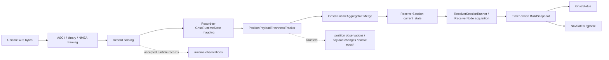

# MowgliNext #694 — Universal GNSS RC2 position-freeze investigation

Baseline: Universal GNSS `v0.7.1-rc2`, commit
`a8583e774786e5da586f5d06c428578b3929facb`.

Field session: `gnss-rc1-test-20260921-1523`, 2026-09-21, 76 seconds,
Unicore receiver, real robot motion. The public field summary is recorded in
[MowgliNext #694](https://github.com/mowglinext/mowglinext/issues/694#issuecomment-5761279974).

## Conclusion

The earliest proven frozen boundary is the **mapped position-observation stream before
runtime aggregation**: RC2's `PositionPayloadFreshnessTracker` receives every successfully
parsed position record before `GnssRuntimeAggregator::Merge`, and the reported field facts say
there was no position-payload change while `position_observation_sequence` advanced by 373.
Consequently, no differing valid mapped latitude/longitude pair reached the aggregator during
the window if that reported payload counter is confirmed.

The supplied `gnss-rc1-test-20260921-1523.jsonl` does not contain that counter or any other
freshness diagnostic value. It independently confirms the published-coordinate, status,
observation, runtime, health, source, and motion facts below, but cannot confirm the reported
payload-change result. That evidence-provenance distinction is now material because PR #7's
mechanism predicts changing pre-prune payloads when moving GGA wire coordinates are present.

That does **not** yet distinguish a receiver-wire freeze from an internal decode/mapping
problem. It also does not establish that all 373 observations contained valid coordinates.
The missing deltas for the already-exposed `valid_position_payload_observations` and
`invalid_position_observations` counters are decisive:

- advancing valid observations would mean the mapper repeatedly produced the same finite
  latitude/longitude pair;
- advancing invalid observations would mean parsed position records reached the mapper but
  did not produce a comparable valid position. In particular, an unsupported Unicore
  position-type token maps to an unknown fix and omits direct coordinates, after which the
  tri-state aggregator preserves the previous RTK-fixed fix and coordinates.

No receiver/hardware root cause is claimed. There is no byte-for-byte receiver-wire capture
for this session, and unchanged coordinates alone are not a receiver failure.

No production fix is proposed. The root cause is not demonstrated yet.

## Supplied JSONL extraction

The provided file contains one metadata row, 756 sample rows, and one summary row covering
`0.397` through `75.998` session seconds. It is a Mowgli field-session schema (`type=sample`),
not the repository hardware-session collector schema (`record_type=sample`). Exhaustive nested
key inspection found no diagnostic array and no key containing `freshness`, `payload`,
`epoch`, or `diagnostic`. Its SHA-256 is
`ffbc964316cc9d971ee4d1736b4c9e362f7c6e3005c3a30c5b752089dfb9e964`.

Available evidence extracted from the samples is:

| Series | Result |
| --- | --- |
| `/gps/fix` latitude | 753 non-null samples; one value, `53.08917273583333` |
| `/gps/fix` longitude | 753 non-null samples; one value, `6.169298125666667` |
| `/gps/fix` altitude | 753 non-null samples; one value, `10.7944` |
| `/gps/fix` stamp | 76 sampled transitions; advances by `74.999669075` s |
| position observation sequence | `1015 -> 1388` (`+373`), 76 sampled transitions |
| runtime observations | `3741 -> 5215` (`+1474`) across 747 receiver snapshots |
| satellites used | changes 35 times in the sampled series, range `18..25` |
| satellites visible/tracked | eight sampled transitions, range `25..28` |
| horizontal accuracy | one value, `0.017000000923871994` m |
| source | one device path and one source incarnation throughout |
| health | transport, parser, and receiver-snapshot call remain true |
| independent motion | summary reports `4.6914037529` m integrated wheel travel |

The requested `valid_position_payload_observations`, `invalid_position_observations`,
`position_payload_change_sequence`, and all `receiver_epoch_*` values are absent rather than
zero. They cannot be reconstructed from cached `/gps/fix` or status values without violating
their observation-level semantics.

## Data flow and observation points

`PositionPayloadFreshnessTracker` is after parsing and mapping but before aggregation.
Therefore it can exclude layers 4–6 as the origin of a lost **differing valid mapped
coordinate**, but it cannot inspect the original wire text/bytes or identify which position
record family produced an observation.

## Position-producing path and counter matrix

All paths below are active in `UnicoreSession` when their records occur in the byte stream.
The normal `rover_high_precision` configuration requests GGA and PVTSLNA at 1 Hz and BESTNAVA
at 5 Hz, but configuration is additive and the actual field wire mix has not been captured.

| Path | Parse/map entry | `runtime_observations` | `position_observations` | payload tracking | receiver epoch |
| --- | --- | ---: | ---: | --- | --- |
| BESTNAVA | `ParseUnicoreBestNav` → `UnicoreBestNavToRuntimeState` | +1 after successful parse | +1 | mapped update observed before merge | header week + TOW, receiver-week domain |
| BESTNAVB | `ParseUnicoreBestNavB` → `UnicoreBestNavBToRuntimeState` | +1 after successful parse | +1 | mapped update observed before merge | binary header week + TOW, receiver-week domain |
| PVTSLNA | `ParseUnicorePvtsln` → `UnicorePvtslnToRuntimeState` | +1 after successful parse | +1 | mapped update observed before merge | header week + TOW, receiver-week domain |
| PVTSLNB | `ParseUnicorePvtslnB` → `UnicorePvtslnBToRuntimeState` | +1 after successful parse | +1 | mapped update observed before merge | binary header week + TOW, receiver-week domain |
| NMEA GGA | `ParseNmeaGga` → `NmeaGgaToRuntimeState` | +1 after successful parse | +1 | mapped GGA observed **before** fallback pruning | UTC time-of-day domain when present |

Counter semantics:

- `runtime_observations` counts successfully parsed supported runtime records, not only
  positions. GGA/GST/GSV and mapped Unicore status/satellite/jamming records also contribute;
  RTCMSTATUSA, HWSTATUSA, and AGCA are parsed/accounted separately and do not increment it.
- `position_observations`, projected as `position_observation_sequence`, counts successfully
  parsed recognized position records. It is accepted observation identity, not payload
  identity, valid-fix identity, aggregate mutation, or publication count. Numerically
  identical and invalid/no-fix position observations still advance it.
- `position_payload_changes` (published as `position_payload_change_sequence`) counts the first
  comparable valid pair and each subsequent exact `double` latitude/longitude pair change.
  Altitude, accuracy, fix type, and covariance are not part of this comparison. Invalid
  observations reset the comparable run; the next valid pair establishes a new baseline and
  increments the counter even if it matches the pre-invalid pair.
- There is no RC2 field named `native_epoch_changes`. The relevant metrics are
  `receiver_epoch_advances`, `consecutive_identical_receiver_epochs`,
  `receiver_epoch_regressions`, `receiver_epoch_relation`, `receiver_epoch_domain`, and
  `receiver_epoch_value`. `receiver_epoch_advances` counts strictly advancing values within
  one domain, including supported TOW rollover; a domain change is reported separately and is
  not an advance.

GGA fallback is important here. Once native Unicore state has populated fix/coordinates,
`PruneNmeaGgaFallback` prevents GGA from overwriting those aggregate fields. The freshness
tracker observes GGA before that pruning, however. A valid changing GGA stream would therefore
advance `position_payload_change_sequence` even if BESTNAV/PVTSLN remained authoritative for
the published state. The flat field counter shows that no such changing valid GGA pair reached
the mapper/tracker boundary.

## Freshness-tracker interpretation

### A. Week/TOW advances; latitude/longitude are unchanged

For each valid record:

- `position_observation_sequence` increments;
- `valid_position_payload_observations` increments;
- `position_payload_change_sequence` stays flat after the first baseline;
- `consecutive_identical_position_observations` increments;
- `receiver_epoch_advances` increments after the first epoch;
- `receiver_epoch_relation=advanced` for the latest transition;
- `consecutive_identical_receiver_epochs=1`;
- `unchanged_observation_span_s` grows using receipt timestamps.

This proves distinct native epochs are reaching the mapping boundary with the same mapped
coordinates. It does not prove whether the wire coordinates were the same.

### B. Week/TOW and latitude/longitude both freeze

For each valid record:

- observation and valid-payload counters increment;
- the payload-change sequence stays flat;
- both consecutive-identical counters increment;
- `receiver_epoch_relation=identical`;
- `receiver_epoch_advances` stays flat.

This is consistent with repeated complete records on the wire, but also with internal replay;
raw bytes are required to distinguish them.

### C. BESTNAV and PVTSLN alternate with different epochs but the same coordinates

Both use the same receiver-week/TOW domain. Payload observations remain identical, so only the
position-observation and valid-payload counts advance. Epoch results are global across all
position families:

- monotonically interleaved epochs produce `advanced` transitions;
- a slower/older family arriving after a newer family produces a `regressed` transition,
  commonly followed by `advanced` when the faster family arrives again;
- equal solution epochs produce `identical` transitions.

RC2 does not attach record-family identity to the freshness metrics, so the counters alone
cannot distinguish BESTNAV from PVTSLN. Interleaved GGA changes the epoch domain between UTC
time-of-day and receiver-week/TOW, producing `domain_changed` rather than an advance or
regression at each cross-domain transition.

## Layer-by-layer findings

### 1. Receiver wire data — unresolved, plausible

The observed rates are approximately 4.97 position observations/s (`373 / 75`) and 19.65
runtime observations/s (`1474 / 75`). The position rate closely matches the normal BESTNAVA
5 Hz period. A receiver that continues to emit checksum-valid BESTNAVA records with fresh
week/TOW but a frozen solution would explain every supplied fact. So would repeated full
BESTNAVA records with a frozen week/TOW.

This remains an inference. There is no raw serial capture, and the field counters do not expose
the contributing record family.

### 2. Unicore framing/parsing — no retention mechanism found; not wire-excluded

- ASCII and binary framers build a new frame and reset their buffers after every completed
  record.
- `UnicoreSession` erases consumed bytes and creates fresh framers while probing each buffered
  record.
- ASCII parsers construct fresh stack-local record/header objects. BESTNAVA and PVTSLNA
  latitude/longitude fields are mandatory; missing, malformed, or non-finite values reject the
  record instead of reusing an old value.
- Binary BESTNAVB/PVTSLNB decoders read latitude/longitude directly from fixed little-endian
  payload offsets into fresh records, after frame CRC and exact payload-length validation.
- The runner supplies only the `bytes_read` portion of a fresh read buffer; no code path re-feeds
  a prior successful chunk.

Parser health only proves a low malformed/rejected-record rate. It is not semantic proof that
decoded coordinates equal wire coordinates. A raw capture replay is still required.

### 3. Record mapping — direct for valid known position types; one unresolved omission path

All four native maps create a fresh `GnssRuntimeState`. For a valid known fix they copy the
record's latitude, longitude, and altitude directly. There is no retained runtime state in a
mapper and no native epoch-to-receipt timestamp conversion that could freeze coordinates;
week/TOW is used only by the freshness tracker, while aggregate timestamps are receipt time.

An important unresolved path exists: a syntactically valid record with an unknown Unicore
position-type token is accepted by the parser, but maps to `fix_type=unknown`, `fix_valid=false`,
and omits direct coordinates. That increments `position_observations` and
`invalid_position_observations`, while the aggregator preserves the preceding valid position.
The field trace's missing valid/invalid counter deltas prevent accepting or rejecting this
mechanism.

A BESTNAV record with a known position type but a non-`SOL_COMPUTED` solution instead maps to
explicit no-fix and clears position fields. Sustained publication of the same RTK-fixed fix is
evidence against that specific case unless another record restores it between samples.

### 4. Runtime aggregation — cannot hide a differing valid mapped coordinate from freshness

`GnssRuntimeAggregator::Merge` uses tri-state per-field semantics:

- a present direct coordinate is SET even when numerically identical;
- an explicit direct clear removes it;
- an omitted direct coordinate preserves the prior value;
- field timestamps reject only strictly older receipt timestamps; equal timestamps are allowed;
- a successful identical SET advances aggregate receipt provenance.

Thus a valid incoming position record with unchanged coordinates is distinguishable from no
position observation by the external `position_observations` counter, but the aggregate state
itself stores only the latest values and receipt timestamp. `Merge` returns whether any field
was applied; it does not retain position-observation identity.

BESTNAV/PVTSLN ASCII and binary records have equal native priority: later arrival/receipt time
wins. A later old-coordinate record can reapply an old position, but if another valid path
alternates with a different position the pre-merge payload-change counter must advance. The
flat field counter is evidence against multi-record overwrite hiding a changing valid mapped
position. The omission path described above can preserve an old coordinate and remains open.

### 5. ReceiverSession and runner — no replay/state replacement found

`ReceiverSession` locks to the selected Unicore child and returns that child's aggregate by
reference. Metrics are copied from the child; there is no second runtime cache or merge.
`ReceiverSessionRunner` timestamps and feeds each newly read chunk once. The stable field
`source_incarnation`, no container restart, and stable selected session are evidence against a
session reset/replacement in the captured window.

### 6. ReceiverNode publication/cache — timer-driven cached aggregate, not event-driven

Input acquisition runs independently (10 ms timer). Publication runs on the configured
`publish_rate_hz` timer and always builds a snapshot by copying
`ReceiverSession::current_state()`.

`/gps/fix` is published whenever:

1. the transport is ready;
2. **any supported runtime observation** has arrived within the configured freshness timeout;
3. cached latitude/longitude are present and finite.

It is not gated by a new position observation or payload change. Consequently non-position
GSV/GST/status/satellite observations can keep an old position publishable, and repeated
timer callbacks republish that cached fieldwise aggregate. Status and diagnostics are published
on every publication timer callback; `NavSatFix` is omitted only when the conditions above fail.

This behavior explains why `/gps/fix` remained active, but it is downstream of the flat
pre-merge payload-change counter and therefore is not the earliest origin of the missing valid
coordinate changes.

## PR #7 as an independent competing hypothesis

[PR #7](https://github.com/Pepeuch/universal-gnss/pull/7), authored by `cedbossneo` against the
same RC2 commit, identifies a concrete Unicore-session arbitration defect: after the first GGA
populates aggregate position fields, `PruneNmeaGgaFallback` omits later GGA position/fix fields
whenever the aggregate already contains them, without considering whether a native
BESTNAV/PVTSLN stream is present or current. `PruneNmeaGstFallback` does the equivalent for
accuracy. Satellite counts remain eligible to update.

This is strong independent evidence for a real defect and matches much of the supplied log:

| #694 evidence | Compatibility with PR #7 mechanism |
| --- | --- |
| frozen latitude, longitude, altitude, and horizontal accuracy | yes; those are precisely the pruned GGA/GST fields |
| advancing observation sequence and message stamps | yes; GGA is counted and observed before pruning |
| satellites used changing `18..25` | yes; the current GGA path preserves satellite updates |
| stable source/incarnation and healthy parser/transport | yes; no failure or restart is required |
| approximately five position observations per second | conditional; compatible with 5 Hz GGA, but the JSONL does not identify the record family |
| reported zero payload changes during motion | **no, if GGA wire coordinates changed**; the tracker observes mapped GGA before pruning and would count those changes |

Therefore PR #7 cannot yet be classified as the demonstrated #694 root cause. It is a likely
contributing publication/aggregation mechanism or a separate Unicore NMEA-only bug. If the
reported flat payload-change counter is confirmed, PR #7 is not sufficient as the sole cause:
the first divergence is already at or before mapping, upstream of its pruning point. If a new
capture instead shows payload changes while aggregate status and `/gps/fix` stay frozen, PR #7's
boundary is demonstrated directly and the investigation should stop there.

Migration disposition: `ADAPT`, hypothesis only. The behavioral requirement—NMEA fallback must
not be suppressed indefinitely when no authoritative native position stream is current—is
valid, but the proposed implementation is not imported and raises contract questions that need
resolution before any later fix:

- its native-freshness marker advances on every successfully parsed native position record,
  including an invalid/no-coordinate record that may not be authoritative;
- the fixed 2.5-second window is not derived from configured/native output periods;
- one native-position timestamp controls both GGA position and GST accuracy arbitration;
- current diagnostics do not expose which record family is controlling authority.

Per the investigation constraint, no PR #7 code was copied, cherry-picked, reimplemented, or
used to alter the test harness. If a later demonstrated #694 fix overlaps this behavior, work
must stop for maintainer/contributor coordination so attribution remains with the PR author.

## Replay evidence

`gnss_driver/tests/test_unicore_session.cpp` now includes
`TestPositionFreshnessSeparatesNativeEpochAndPayloadChanges`. It feeds checksum-valid BESTNAVA
records through framing, parsing, mapping, freshness tracking, and aggregation:

1. advancing week/TOW with identical coordinates;
2. repeated week/TOW with identical coordinates;
3. advancing week/TOW with a changed latitude.

The test proves:

- all records advance runtime and position observations;
- identical coordinate SETs are accepted and advance receipt provenance;
- native-epoch advancement and identity are independent from payload identity;
- the later changed coordinate advances the payload-change sequence and reaches aggregate
  state.

Existing ROS2 tests independently prove that timer publication does not invent observations,
identical new observations advance position identity, and cached publication preserves the
same observation identity.

## Minimal next field evidence

The supplied JSONL has been exhausted and does not contain the freshness diagnostic. The next
narrow step is a real-Unicore capture of `universal_gnss/position_payload_freshness`, retaining
a start/end/time series for:

- `valid_position_payload_observations`
- `invalid_position_observations`
- `position_payload_change_sequence`
- `consecutive_identical_position_observations`
- `unchanged_observation_span_s`
- `receiver_epoch_domain`
- `receiver_epoch_value`
- `receiver_epoch_relation`
- `receiver_epoch_advances`
- `consecutive_identical_receiver_epochs`
- `receiver_epoch_regressions`
- `position_observation_sequence`

Also retain `runtime_observations`, `runtime_updates`, all Unicore
seen/parsed/rejected/malformed/unknown counters, source id/incarnation, and the status/fix
coordinate series.

Also capture raw `/gps/fix`, the portable receiver status, and independent motion over the same
interval. These diagnostics distinguish valid repeated mapped positions from invalid/omitted
mapped positions, advancing epochs from repeated epochs, and PR #7's post-tracker pruning
mechanism from an upstream freeze. Stop as soon as one boundary diverges.

Only if ambiguity remains after those counters, capture a short, byte-for-byte copy of the exact
receiver RX stream consumed by `ReceiverNode`, synchronized with proven robot motion and the
diagnostic values above. Use a single owning reader or an in-path byte tap; do not attach a
second competing serial reader. Preserve:

- complete CRC-bearing BESTNAVA/PVTSLNA/GGA lines and/or complete BESTNAVB/PVTSLNB frames;
- message identity, position type/solution status, week/TOW or GGA UTC, and raw coordinates;
- enough pre-motion and moving samples to show at least one expected coordinate change.

Run the capture through existing `gnss_inspect` and `gnss_replay`, and retain a small sanitized
byte-for-byte reproducer if it exposes an internal discrepancy.

Decision outcomes:

| Evidence | Earliest demonstrated origin |
| --- | --- |
| raw coordinates frozen, raw epoch advances | receiver/firmware wire output for that captured baseline |
| complete raw record and epoch both repeat | at or before receiver wire; physical/firmware/transport source still needs baseline-specific attribution |
| raw coordinates change, mapped valid counter/payload does not | framing/parsing/mapping defect; create a replay regression from those bytes |
| invalid counter advances and raw position type is unsupported | record-mapping coverage/invalidity path |
| mapped payload-change counter advances but aggregate `/status` coordinates do not | aggregation/arbitration defect; PR #7 becomes the leading demonstrated mechanism for GGA |
| aggregate status changes but `/gps/fix` does not | ReceiverNode/NavSatFix projection/publication defect |

No new production diagnostic is necessary for this first live discriminator. If the existing
fields still leave wire versus mapping ambiguous and an in-path raw capture is operationally
unavailable, the narrowest additional diagnostic would be per-position-record-family
valid/invalid counts plus the latest family and native epoch; it would improve localization but
still would not replace wire-level evidence.

This workspace cannot execute the physical step: `/dev/serial/by-id` is absent, no Universal
GNSS/receiver process is running, and USB enumeration is unavailable. The missing input is
device pass-through or the resulting synchronized ROS diagnostic capture from the robot. Raw
bytes are not yet classified as mandatory because the live freshness counters may demonstrate
PR #7's post-tracker divergence first.

## Current status

- Earliest frozen boundary from the originally reported payload counter: no differing valid
  coordinate at the post-mapping/pre-aggregation freshness boundary. The supplied JSONL alone
  cannot confirm that counter.
- Internal state-retention defect demonstrated: none.
- Receiver-wire failure demonstrated: no (`HARDWARE_REQUIRED`).
- PR #7 mechanism: field-signature compatible, but a confirmed flat pre-prune payload counter
  would contradict it as the sole cause; likely contributing or separate, not yet demonstrated
  as the same root cause.
- Remaining discriminator: narrow live valid/invalid/payload/native-epoch diagnostics; exact raw
  receiver bytes only if those remain ambiguous.
- Proposed fix: none until one of the decision outcomes above is demonstrated.

## Validation at the RC2 baseline

- The new integrated BESTNAVA replay test built and passed directly.
- The full portable CTest suite passed. The sandbox run passed 63 of 68 tests; the five
  loopback/socket-dependent tests then passed unchanged with normal network access.
- The ROS2 package built in a disposable workspace against ROS 2 Kilted. The complete run with
  a writable `ROS_LOG_DIR` and normal DDS/loopback access passed all nine CTest targets and all
  128 underlying cases. In the sandbox-only run, the two socket-dependent targets failed with
  `Operation not permitted`; the other seven targets passed, including all ten combined launch
  cases.
- `clang-format-21` check passed for the touched C++ test.
- `git diff --check` passed.

No hardware acceptance test was performed. That is the evidence required to unblock root-cause
attribution, not a regression introduced by this analysis-only change.
